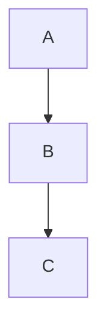

# Next Duck Blog - Architecture & Development Guide

## 대화 언어
한국어로 대화합니다.

## 프로젝트 개요
Next.js 기반 개인 기술 블로그. Contentlayer를 사용해 MDX 콘텐츠를 관리하며, Tailwind CSS로 스타일링된 모던 블로그 플랫폼입니다.

**주요 기술 스택:**
- Next.js 14 (App Router, React Server Components)
- TypeScript
- Contentlayer2 (MDX 콘텐츠 관리)
- Tailwind CSS 3
- Firebase (데이터 저장)
- Pliny (분석, 검색, 뉴스레터)

---

## 프로젝트 구조

### 핵심 디렉토리

```
next-duck-blog/
├── app/                    # Next.js App Router (페이지, API 라우트)
│   ├── blog/              # 블로그 관련 페이지
│   │   ├── [...]slug]/    # 동적 블로그 포스트 페이지
│   │   └── page/[page]/   # 페이지네이션
│   ├── api/               # API 엔드포인트
│   │   ├── blog/          # 블로그 저장
│   │   ├── images/upload/ # 이미지 업로드
│   │   ├── blog-ideas/    # 블로그 아이디어 API
│   │   └── newsletter/    # 뉴스레터
│   ├── editor/            # 블로그 에디터 페이지
│   ├── tags/              # 태그 페이지
│   ├── projects/          # 프로젝트 페이지
│   ├── about/             # 소개 페이지
│   ├── layout.tsx         # 루트 레이아웃 (폰트, 메타데이터, 프로바이더)
│   ├── page.tsx           # 홈페이지
│   └── seo.tsx            # SEO 유틸리티
│
├── data/                  # 사이트 설정 및 블로그 콘텐츠
│   ├── blog/              # MDX 블로그 포스트
│   │   ├── web/           # 웹 개발 관련
│   │   ├── js/            # JavaScript 관련
│   │   ├── algorithm/     # 알고리즘
│   │   ├── nextjs/        # Next.js 관련
│   │   ├── react/         # React 관련
│   │   ├── daily/         # 일상/회고
│   │   └── travel/        # 여행
│   ├── authors/           # 저자 프로필 (MDX)
│   ├── siteMetadata.js    # 사이트 전역 설정
│   ├── headerNavLinks.ts  # 네비게이션 링크
│   ├── projectsData.ts    # 프로젝트 정보
│   └── logo.svg           # 로고
│
├── components/            # React 컴포넌트
│   ├── MDXComponents.tsx  # MDX 커스텀 컴포넌트 (Expand, SOLIDChecklistModal 등)
│   ├── editor/            # 블로그 에디터 관련 컴포넌트
│   │   ├── AdvancedWysiwygEditor.tsx
│   │   ├── MarkdownEditor.tsx
│   │   ├── UltimateEditor.tsx
│   │   ├── ImageUploader.tsx
│   │   └── MetadataPanel.tsx
│   ├── Header.tsx         # 헤더 (네비게이션)
│   ├── Footer.tsx         # 푸터
│   ├── ThemeSwitch.tsx    # 다크/라이트 모드 토글
│   ├── Link.tsx           # 커스텀 링크
│   ├── Image.tsx          # 최적화된 이미지
│   └── analytics/         # 분석 관련 컴포넌트
│
├── layouts/               # 블로그 포스트 레이아웃 템플릿
│   ├── PostLayout.tsx     # 기본 레이아웃 (메타정보 2단 구성)
│   ├── PostSimple.tsx     # 간단한 레이아웃
│   ├── PostBanner.tsx     # 배너 이미지 포함
│   ├── PostModern.tsx     # 모던 레이아웃
│   ├── ListLayout.tsx     # 블로그 목록 (검색바 포함)
│   ├── ListLayoutWithTags.tsx # 블로그 목록 (태그 사이드바)
│   └── AuthorLayout.tsx   # 저자 프로필 레이아웃
│
├── lib/                   # 유틸리티 함수
│   └── firebase.ts        # Firebase 설정
│
├── css/                   # 스타일시트
│   ├── tailwind.css       # Tailwind 설정
│   ├── prism.css          # 코드 하이라이팅 스타일
│
├── public/                # 정적 자산
│   ├── static/
│   │   ├── images/        # 블로그 이미지 (카테고리별)
│   │   ├── favicons/      # 파비콘
│   │   └── ads.txt        # Google AdSense
│   └── fonts/             # 커스텀 폰트 (Pretendard, FiraCode)
│
├── contentlayer.config.ts # Contentlayer 설정 (MDX 처리)
├── next.config.js         # Next.js 설정 (보안, 이미지, 번들 분석)
├── tailwind.config.js     # Tailwind CSS 설정
├── tsconfig.json          # TypeScript 설정
├── .eslintrc.js           # ESLint 규칙
└── .env                   # 환경변수
```

---

## 콘텐츠 관리 (Contentlayer)

### MDX 포스트 작성 구조

**파일 위치:** `data/blog/[카테고리]/[파일명].mdx`

**카테고리:**
- `web/` - 웹 개발 (브라우저, HTTP, 번들러 등)
- `js/` - JavaScript (ES6+, 문법, 패턴)
- `algorithm/` - 알고리즘 & 자료구조
- `nextjs/` - Next.js 관련
- `react/` - React 관련
- `daily/` - 일상/회고/경험담
- `travel/` - 여행 후기

### Frontmatter 스키마
```yaml
---
title: 포스트 제목
date: "2025-11-09"           # 발행일 (YYYY-MM-DD)
tags: [tag1, tag2]          # 태그 (선택, 검색 및 분류용)
lastmod: "2025-11-09"       # 수정일 (선택)
draft: false                # 임시 저장 (true면 비공개)
summary: "한줄 요약"         # SEO 및 목록에 사용
images: ["/static/..."]     # 썸네일 이미지
authors: [default]          # 저자 (기본값: default)
layout: PostLayout          # 레이아웃 (기본값: PostLayout)
canonicalUrl: "https://..." # Canonical URL (SEO)
---
```

### Contentlayer 처리 흐름

1. **파일 감지:** `data/blog/**/*.mdx` 자동 감지
2. **MDX 처리:**
   - Remark 플러그인: 마크다운 파싱, 목차 추출, 코드 블록 처리
   - Rehype 플러그인: HTML 생성, 코드 하이라이팅(Prism), 수학 렌더링(KaTeX)
3. **Computed Fields 생성:**
   - `readingTime` - 읽기 시간 계산
   - `slug` - URL 경로
   - `toc` - 목차
   - `structuredData` - JSON-LD 스키마
4. **메타데이터 생성:**
   - `app/tag-data.json` - 태그별 포스트 수
   - `public/search.json` - kbar 검색 인덱스

---

## 블로그 렌더링 파이프라인

### 동적 라우트: `app/blog/[...slug]/page.tsx`

```typescript
// 1. URL 파라미터 → slug 생성
// 예: /blog/web/yarn-berry → slug = "web/yarn-berry"

// 2. Contentlayer에서 포스트 조회
const post = allBlogs.find((p) => p.slug === slug);

// 3. 레이아웃 선택 (post.layout 또는 PostLayout 기본값)
const Layout = layouts[post.layout || defaultLayout];

// 4. MDX 렌더링 + 레이아웃 적용
<Layout>
  <MDXLayoutRenderer code={post.body.code} components={components} />
</Layout>
```

### 정적 생성 (SSG)
```typescript
export const generateStaticParams = async () => {
  return allBlogs.map((p) => ({ slug: p.slug.split('/') }));
};
```
- 빌드 시 모든 포스트를 정적 HTML로 사전 생성합니다
- 매우 빠른 페이지 로딩을 제공합니다 (CDN 캐시 가능)

---

## 커스텀 MDX 컴포넌트

`components/MDXComponents.tsx`에 정의. MDX 파일에서 직접 사용 가능:

```jsx
// 기본 컴포넌트 (pliny 라이브러리)
<TOCInline />              // 목차 (자동 생성)
<BlogNewsletterForm />     # 뉴스레터 폼

// 커스텀 컴포넌트
<Image />                  // Next.js Image (최적화)
<DoubleImage />           // 나란히 두 이미지
<ExpandableSection />     // 접었다펼 수 있는 섹션
<CodeComparison />        // 코드 비교
<Mermaid />               // Mermaid 다이어그램
<SOLIDChecklistModal />   // SOLID 원칙 체크리스트 (모달)
<ChromeDevToolsMCPSetupModal /> // Chrome DevTools MCP 설정 (모달)

// 그 외
<a />                     // 외부링크 자동 처리
<table />                 // 테이블 스타일링
<pre />                   // 코드 블록 (Mermaid 자동 감지)
```

### Mermaid 다이어그램
```javascript
// 자동으로 감지되어 렌더링됨

```

---

## 빌드 및 배포 설정

### Next.js 설정 (`next.config.js`)

**핵심 기능:**
- **Contentlayer 통합** - MDX 처리
- **이미지 최적화** - 반응형, webp/avif 지원
- **보안 헤더** - CSP, HSTS, X-Frame-Options 등
- **번들 분석** - `ANALYZE=true npm run build`
- **SVG 지원** - @svgr/webpack으로 SVG → React 컴포넌트

**원격 이미지 도메인:**
- `picsum.photos` - 샘플 이미지
- `media.giphy.com`, `i.giphy.com` - GIF

### 보안 정책 (CSP)
Google AdSense, Giscus (댓글), Google Analytics 등의 스크립트를 허용합니다.
추가 서비스 사용 시 `next.config.js`의 CSP를 업데이트해야 합니다.

### Tailwind CSS 설정

**폰트 스택:**
- 기본: Pretendard (한글), Inter (영문)
- 디스플레이: Space Grotesk
- 코드: FiraCode

**색상:**
- Primary: Emerald (초록)
- 다크모드: `darkMode: 'class'` (수동 토글)

**Typography:** 마크다운 콘텐츠 스타일 (h1, code, pre 등)

---

## 사이트 설정 (`data/siteMetadata.js`)

```javascript
{
  // 기본 정보
  title: "duck blog | 기술 블로그",
  author: "Deokgoo",
  siteUrl: "https://duck-blog.vercel.app",
  
  // 분석 (Umami, Google Analytics)
  analytics: { 
    umamiAnalytics: { umamiWebsiteId: process.env.NEXT_UMAMI_ID },
    googleAnalytics: { googleAnalyticsId: "G-PN28LVMCKG" }
  },
  
  // 댓글 (Giscus)
  comments: { 
    provider: 'giscus',
    giscusConfig: { ... }
  },
  
  // 검색 (kbar)
  search: { 
    provider: 'kbar',
    kbarConfig: { searchDocumentsPath: 'search.json' }
  },
  
  // 뉴스레터 (Mailchimp)
  newsletter: { provider: 'mailchimp' }
}
```

---

## API 엔드포인트

### `POST /api/blog/save`
블로그 에디터에서 포스트 임시저장을 처리합니다 (Firebase)

### `POST /api/images/upload`
이미지 업로드를 처리합니다

### `POST /api/blog-ideas`
블로그 아이디어를 저장합니다

### `GET/POST /api/blog-ideas/auth`
인증을 처리합니다 (예: 비밀번호 검증)

### `POST /api/newsletter`
뉴스레터 구독을 처리합니다

---

## 에디터 컴포넌트 (`components/editor/`)

블로그 작성용 풀스택 에디터:

- **AdvancedWysiwygEditor.tsx** - WYSIWYG 에디터
- **MarkdownEditor.tsx** - Markdown 플레인 에디터
- **WysiwygEditor.tsx** - 기본 WYSIWYG
- **UltimateEditor.tsx** - 통합 에디터 (탭식)
- **IntegratedEditor.tsx** - 엣지 케이스용
- **ImageUploader.tsx** - 이미지 업로드 UI
- **MetadataPanel.tsx** - Frontmatter 메타데이터 편집

**접근:**
- `/editor` - 마크다운 에디터
- `/editor/integrated` - 통합 에디터

---

## 개발 가이드

### 로컬 개발 환경 설정

```bash
# 의존성 설치
npm install
# 또는
yarn install
# 또는 pnpm
pnpm install

# 개발 서버 시작 (Hot Reload)
npm run dev
# http://localhost:3000

# 빌드
npm run build

# 프로덕션 실행
npm run serve

# 번들 분석
ANALYZE=true npm run build

# Lint
npm run lint
```

### 환경변수 (`.env`)

```bash
# Firebase
NEXT_PUBLIC_FIREBASE_API_KEY=...
NEXT_PUBLIC_FIREBASE_AUTH_DOMAIN=...
NEXT_PUBLIC_FIREBASE_PROJECT_ID=...
NEXT_PUBLIC_FIREBASE_STORAGE_BUCKET=...
NEXT_PUBLIC_FIREBASE_MESSAGING_SENDER_ID=...
NEXT_PUBLIC_FIREBASE_APP_ID=...

# Analytics (Umami)
NEXT_UMAMI_ID=...

# Comments (Giscus)
NEXT_PUBLIC_GISCUS_REPO=deokgoo/next-duck-blog
NEXT_PUBLIC_GISCUS_REPOSITORY_ID=...
NEXT_PUBLIC_GISCUS_CATEGORY=...
NEXT_PUBLIC_GISCUS_CATEGORY_ID=...
```

### 블로그 포스트 작성 흐름

1. **새 파일 생성:** `data/blog/[카테고리]/[파일명].mdx`
2. **Frontmatter 작성:** 제목, 날짜, 태그, 요약 등
3. **MDX 콘텐츠 작성:**
   - 마크다운 문법
   - 커스텀 컴포넌트 삽입
   - 이미지는 `/static/images/[카테고리]/` 경로 사용
4. **로컬에서 미리보기:** `npm run dev`로 실시간 확인
5. **빌드 및 배포:** Git push → Vercel 자동 배포

### 이미지 경로 규칙

```
/static/images/[카테고리]/[파일명].png

예:
/static/images/web/yarn-berry.png
/static/images/js/async-await.jpg
/static/images/algorithm/binary-search.svg
```

### 코드 블록 언어 명시

```markdown
\`\`\`javascript
const x = 42;
\`\`\`

\`\`\`typescript
const x: number = 42;
\`\`\`

\`\`\`bash
npm run dev
\`\`\`

\`\`\`mermaid
graph TD
  A --> B
\`\`\`
```

---

## 배포 (Vercel)

### 자동 배포 설정
- **Main 브랜치:** 자동으로 프로덕션 배포됩니다
- **Preview:** PR마다 Preview URL을 생성합니다

### 배포 체크리스트
1. `.env` 환경변수를 설정합니다 (Vercel 대시보드)
2. `contentlayer.config.ts`를 검증합니다
3. 빌드 성공을 확인합니다: `npm run build`
4. Git push → Vercel 자동 배포됩니다

---

## 성능 최적화

### 이미지 최적화
- Next.js `<Image />` 컴포넌트를 사용합니다 (자동 크기 최적화)
- WebP/AVIF 형식을 지원합니다
- 반응형 이미지를 제공합니다 (deviceSizes, imageSizes)

### 번들 크기
- 필요한 의존성만을 사용합니다
- 번들 분석을 지원합니다: `ANALYZE=true npm run build`
- 동적 import를 활용합니다

### 캐싱
- SSG로 정적 페이지를 사전 생성합니다
- CDN 캐시를 활용합니다: 이미지, CSS, JS
- ISR (Incremental Static Regeneration)을 미사용합니다 (순수 SSG)

---

## 핵심 용어 정리

| 용어 | 설명 |
|------|------|
| **Contentlayer** | MDX/마크다운 → JSON 변환 도구 |
| **MDX** | Markdown + JSX 혼합 형식 |
| **Pliny** | 분석, 검색, 뉴스레터 통합 라이브러리 |
| **Remark** | 마크다운 파서 및 처리 플러그인 |
| **Rehype** | HTML 처리 플러그인 |
| **Frontmatter** | 마크다운 맨 앞 메타데이터 (YAML) |
| **SSG** | Static Site Generation (빌드 시 생성) |
| **Slug** | URL 경로 (예: "web/yarn-berry") |

---

## 블로그 작성 팁

### 문체 및 어투 가이드라인
**격식 있는 문어체 사용**
- "~습니다", "~었습니다", "~됩니다" 등 격식 있는 문어체를 사용합니다
- "~해요", "~어요", "~거든요", "~잖아요" 등 요체는 피합니다
- 전문적이고 신뢰감 있는 톤을 유지합니다

**나쁜 예시:**
```
이 기능을 사용해봤는데 정말 좋더라고요. 성능이 많이 올라가거든요.
```

**좋은 예시:**
```
이 기능을 사용한 결과 성능이 크게 향상되었습니다.
```

### 실무 기반 콘텐츠 우선
- 실제 프로젝트에서 겪은 문제 해결기
- 구체적인 코드 예제
- 성능 수치 및 벤치마크

### 독자가 따라할 수 있는 구조
1. 문제 상황 설명
2. 원인 분석
3. 해결 방법 (코드 포함)
4. 결과 및 인사이트

### SEO 최적화
- `summary`: 간결한 한줄 요약
- `images`: 썸네일 이미지
- `tags`: 적절한 태그 선택
- 내부 링크: 관련 포스트 연결

---

## 자주 사용되는 명령어

```bash
# 개발
npm run dev                # 개발 서버 시작
npm run build              # 빌드
npm run serve              # 프로덕션 실행

# 린팅
npm run lint               # ESLint 실행 및 자동 수정

# 번들 분석
ANALYZE=true npm run build # 번들 크기 분석

# 환경 테스트
INIT_CWD=$PWD npm run dev  # Windows 환경 호환성
```

---

## 리소스

- **Contentlayer 문서:** https://www.contentlayer.dev/
- **Next.js 문서:** https://nextjs.org/docs
- **Tailwind CSS:** https://tailwindcss.com/
- **Pliny:** https://github.com/timlrx/pliny
- **MDX:** https://mdxjs.com/

---

**Last Updated:** 2025-11-09  
**프로젝트:** Next Duck Blog (개인 기술 블로그)
