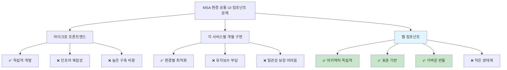
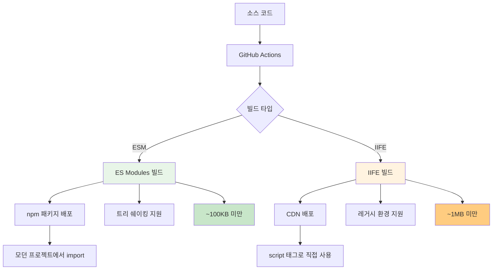

## 들어가기 전에

MSA 환경에서 서로 다른 아키텍처를 사용하는 서비스들 간에 공통 UI 컴포넌트를 제공해야 하는 상황은 많은 개발팀이 겪는 공통적인 고민입니다.

각 서비스가 독립적인 기술 스택을 사용하는 환경에서 동일한 UI 컴포넌트를 적용해야 할 때, 서비스마다 별도로 구현하는 것은 유지보수 측면에서 비효율적입니다.

이 글에서는 이런 환경에서 웹 컴포넌트를 활용한 접근법과 LIT 프레임워크를 통한 구현 방법을 다룹니다.

## MSA 환경에서의 UI 컴포넌트 문제

### 파편화된 서비스 아키텍처

MSA(Microservices Architecture) 환경에서는 각 서비스가 독립적인 기술 스택을 사용하는 경우가 많습니다

<div className="flex flex-col items-center flex-wrap overflow-hidden">
  <div className="my-1 px-2 overflow-hidden xl:px-2 w-3/4">
    
  </div>
</div>

- **모던 SPA 기반 서비스** - 컴포넌트 기반 아키텍처
- **서버 사이드 렌더링 환경** - 전통적인 MVC 패턴
- **하이브리드 환경** - 점진적 마이그레이션 중인 시스템
- **레거시 시스템** - 기존 운영 중인 서비스들

### 공통 UI 컴포넌트의 딜레마

**아키텍처 관련**

- 각 서비스마다 다른 방식으로 동일 기능 구현
- 디자인 시스템 변경 시 모든 서비스를 개별 수정
- 레거시 환경에서는 이벤트 기반 처리로 인한 코드 추적 어려움
- 서버 사이드 환경에서 DOM 조작을 통한 비효율적인 업데이트 패턴

**개발 및 운영 관련**

- 각 서비스별 개발 환경과 도구의 차이
- 일관성 있는 사용자 경험 제공의 어려움
- 서비스 간 컨텍스트 스위칭으로 인한 개발 생산성 저하

## 기술 선택의 여정

### 고려했던 조건

- **다양한 환경 대응**: 서로 다른 아키텍처에서 모두 사용 가능
- **렌더링 최적화**: 효율적인 업데이트 메커니즘 필요
- **가벼운 번들**: 여러 서비스에 임베드되므로 크기가 중요
- **개발 편의성**: 팀 간 협업을 위한 낮은 러닝커브

### 검토한 옵션들



**1. 마이크로 프론트엔드**

- 장점: 각 팀이 독립적으로 개발 가능
- 단점: 인프라 구축 비용과 복잡성 증가

**2. 각 서비스별 개별 구현**

- 장점: 각 환경에 최적화 가능
- 단점: 유지보수 부담, 일관성 보장 어려움

**3. 웹 컴포넌트 (최종 선택)**

- 장점: 아키텍처 독립적, 표준 기반, 가벼움
- 단점: 생태계가 상대적으로 작음

## 웹 컴포넌트(LIT)를 선택한 이유

> 💡 **핵심 요약**
> MSA 환경에서 서로 다른 아키텍처 간 공통 UI 컴포넌트를 제공하기 위해 웹 컴포넌트를 선택한 5가지 핵심 이유

### 1. 표준 기반 기술 ⭐️⭐️⭐️⭐️

웹 컴포넌트는 W3C 표준으로, 브라우저 네이티브 기술입니다.

특정 아키텍처에 종속되지 않아 어떤 환경에서든 재사용할 수 있습니다. Shadow DOM을 통한 스타일 캡슐화로 CSS 충돌 문제를 원천 차단할 수 있습니다.

```html
<!-- 어떤 환경에서든 동일하게 동작 -->
<ui-component data-id="123"></ui-component>
```

### 2. 경량화와 성능 ⭐️⭐️⭐️

LIT는 매우 작은 번들 사이즈를 제공합니다 (~5KB gzipped). Virtual DOM 대신 효율적인 템플릿 시스템을 사용하여 성능이 우수하고, 필요한 부분만 업데이트하는 세밀한 반응성을 제공합니다.

실제로 여러 라이브러리를 사용하고 비즈니스 로직이 복잡한 컴포넌트를 구현했을 때도 IIFE 방식의 빌드 결과가 1MB 미만이었습니다. 더욱 인상적인 것은 ESM 모듈로 사용하는 경우 대부분 100KB 미만의 크기를 유지한다는 점입니다. 이는 트리 쉐이킹과 모듈 시스템의 장점을 최대한 활용할 수 있기 때문입니다.

<div className="flex flex-col items-center flex-wrap overflow-hidden">
  <div className="my-1 px-2 overflow-hidden xl:px-2 w-2/3">
    
  </div>
</div>

> **참고사항**
>
> 1. **전체 번들 크기**: 모듈 구성에 따라 ESM/IIFE 우위가 바뀔 수 있음
> 2. **실제 사용 시**: ESM의 트리 셰이킹으로 필요한 부분만 로드하여 크기 최적화
> 3. **개발 권장사항**: 모던 환경에서는 ESM 사용으로 성능 최적화 달성

### 3. 개발 경험 개선 ⭐️⭐️⭐️⭐️

현대적인 개발 환경을 완벽 지원합니다:

- **TypeScript 완전 지원**: 타입 안정성 확보
- **모던 JavaScript**: ES6+, decorators 등 최신 문법 사용 가능
- **HMR 지원**: 개발 중 빠른 피드백 루프 구현
- **명확한 라이프사이클**: 예측 가능한 컴포넌트 동작

### 4. 아키텍처 독립성 ⭐️⭐️⭐️⭐️

> **핵심 장점**
> 다양한 기술 스택과 함께 사용 가능하며, 기존 레거시 코드와도 점진적 마이그레이션이 가능합니다.

각 서비스가 다른 기술 스택을 사용해도 전혀 문제없습니다.

### 5. 유지보수성 ⭐️⭐️⭐️

컴포넌트 기반 아키텍처의 모든 장점을 제공합니다:

- **코드 재사용성 극대화**
- **명확한 props와 이벤트 시스템**으로 데이터 흐름 추적 용이
- **테스트 작성**이 훨씬 쉬워짐

## 웹 컴포넌트에 대한 이해

### 웹 컴포넌트의 탄생 배경

웹 개발 생태계는 오랫동안 컴포넌트 재사용성과 캡슐화 문제로 고민해왔습니다. 각 프레임워크마다 다른 방식으로 컴포넌트를 구현하다 보니, 프로젝트 간 컴포넌트 공유가 어려웠고, 특정 프레임워크에 종속되는 문제가 있었습니다.

2010년 구글에서 시작된 Polymer 프로젝트는 이러한 문제를 해결하기 위해 웹 표준 기반의 컴포넌트 시스템을 제안했습니다. 초기에는 브라우저 지원이 부족해 polyfill을 통해 기능을 구현했지만, 2016년 W3C에서 웹컴포넌트 표준이 공식 채택되면서 현재는 IE를 제외한 모든 모던 브라우저에서 네이티브 지원됩니다.

### 웹 컴포넌트를 구성하는 핵심 기술들

웹 컴포넌트는 4가지 핵심 웹 표준 기술의 조합으로 구성됩니다:

<div className="flex flex-col items-center flex-wrap overflow-hidden">
  <div className="my-1 px-2 overflow-hidden xl:px-2 w-2/3">
    
  </div>
</div>

**1. Custom Elements**

- 개발자가 직접 HTML 태그를 정의할 수 있게 해주는 기술
- `<comment-widget>`, `<user-profile>` 같은 커스텀 태그 생성 가능
- 태그의 생명주기(생성, 연결, 해제 등) 관리
- 브라우저가 네이티브 HTML 요소처럼 인식하고 처리

**2. Shadow DOM**

- 컴포넌트의 내부 구조와 스타일을 외부로부터 완전히 격리시키는 기술
- CSS 스타일 충돌 방지 (스타일 캡슐화)
- DOM 구조 은닉으로 외부 스크립트의 간섭 차단
- 컴포넌트 내부 로직의 안전한 보호

**3. HTML Templates & Slots**

- **HTML Template**: 재사용 가능한 HTML 마크업 템플릿 정의
- **Slot**: 컴포넌트 사용자가 내용을 삽입할 수 있는 플레이스홀더 제공
- 컴포넌트의 유연성과 재사용성 극대화

**4. ES Modules**

- 웹컴포넌트를 모듈 단위로 관리하고 import/export할 수 있게 해주는 기술
- 컴포넌트별 독립적인 파일 관리
- 의존성 관리와 지연 로딩 지원
- 트리 쉐이킹을 통한 번들 크기 최적화

### 간단한 LIT 컴포넌트 예시

```typescript
import { LitElement, html, css } from 'lit';
import { customElement, property } from 'lit/decorators.js';

@customElement('user-card')
export class UserCard extends LitElement {
  static styles = css`
    :host {
      display: block;
      padding: 16px;
      border: 1px solid #ddd;
      border-radius: 8px;
    }
  `;

  @property() name = '';
  @property() email = '';

  render() {
    return html`
      <h3>${this.name}</h3>
      <p>${this.email}</p>
      <button @click=${this._handleClick}>Contact</button>
    `;
  }

  private _handleClick() {
    this.dispatchEvent(
      new CustomEvent('contact', {
        detail: { name: this.name, email: this.email },
      })
    );
  }
}
```

```html
<!-- 어떤 환경에서든 동일하게 사용 -->
<user-card name="홍길동" email="hong@example.com"></user-card>
```

## 실제 구현 과정

### 기술 스택 선택

**빌드 도구**: Vite - 빠른 개발 서버와 HMR 지원
**컴포넌트 프레임워크**: LIT - 가벼우면서도 강력한 웹 컴포넌트 라이브러리
**언어**: TypeScript - 타입 안정성과 개발 경험 향상
**패키지 관리**: pnpm - 효율적인 의존성 관리

### 배포 및 버전 관리

**배포 전략**

GitHub Actions를 통해 자동 배포를 구성했습니다. 다양한 환경을 고려해 두 가지 빌드 버전을 제공합니다:



**ESM 버전**

- 모던 프로젝트에서 package manager를 활용한 트리쉐이킹 지원
- npm을 통해 배포 및 설치

**IIFE 버전**

- 레거시 환경이나 즉시 실행이 필요한 환경 지원
- CDN을 통해 제공

**버전 관리**

프로젝트별로 버전 요구사항이 다를 수 있어 개별 버전 지정을 권장합니다:

- package.json의 버전을 기준으로 관리
- 개발/스테이징 환경: 환경명과 커밋 해시값을 suffix로 추가
- CDN: path로 버전 구분

## 실무에서 마주한 궁금증들 (POC 결과)

### Q: 기존 프로젝트와의 호환성은 어떤가요?

**A: 완벽한 호환성을 보여줍니다.**

웹 컴포넌트는 기존 프로젝트들에 자연스럽게 통합되었습니다. 실제로 웹 컴포넌트라고 별도로 알려주지 않으면 기존 HTML 요소와 구분하기 어려울 정도로 seamless하게 동작합니다.

- 기존 jQuery 기반 코드와 함께 동작
- JSP 템플릿 내에서 일반 HTML 태그처럼 사용 가능
- 기존 CSS 프레임워크와 충돌 없이 공존
- 점진적 마이그레이션이 가능한 구조

### Q: 사이드 이펙트는 발생하지 않나요?

**A: 웹 컴포넌트의 캡슐화 특성으로 인해 사이드 이펙트가 최소화됩니다.**

**스타일 격리**

- Shadow DOM 캡슐화로 내부 CSS가 외부와 완전히 격리
- 글로벌 CSS가 컴포넌트 내부에 영향을 주지 않음
- 클래스명이나 ID 충돌 걱정 없이 개발 가능

**이벤트 처리**

- 컴포넌트 내부에서 발생한 이벤트는 정상적으로 버블링
- 상위 컴포넌트가 이벤트 핸들링을 하지 않으면 자연스럽게 무시
- 필요한 이벤트만 외부로 전파하도록 제어 가능

**오류 격리 및 안정성**

- 컴포넌트에서 문제가 발생해도 전체 시스템에 미치는 영향이 제한적
- 렌더링 오류 시 해당 컴포넌트만 영향받고 다른 부분은 정상 동작
- Graceful degradation 가능

### Q: 성능상 이슈는 없나요?

**A: 오히려 성능 향상을 경험했습니다.**

- **번들 크기 감소**: LIT의 작은 런타임 크기로 전체 번들 사이즈 최적화
- **효율적인 렌더링**: Virtual DOM 없이도 필요한 부분만 업데이트하는 효율적인 렌더링
- **지연 로딩**: ES Modules를 통한 컴포넌트별 지연 로딩 지원
- **메모리 효율성**: Shadow DOM의 격리된 환경으로 메모리 누수 방지

### Q: 개발 생산성은 어떤가요?

**A: 현저한 개발 생산성 향상을 확인했습니다.**

- **컴포넌트 재사용**: 한 번 개발한 컴포넌트를 여러 서비스에서 재사용
- **디버깅 용이성**: 명확한 컴포넌트 경계로 문제 지점 파악이 쉬움
- **타입 안정성**: TypeScript 완전 지원으로 런타임 오류 사전 방지
- **HMR 지원**: 개발 중 빠른 피드백 루프 구현

**다만, 초기 러닝커브는 존재합니다.**

처음에는 AI 도구를 활용해 빠른 개발과 학습을 진행했지만, 비즈니스 로직이 복잡해지면서 함수형 컴포넌트에 익숙한 개발자들이 Class 형태의 컴포넌트 구성에 적응하는 시간이 필요했습니다. 특히 Reactive Controller나 각 Custom Element가 독립적인 라이프사이클을 가진다는 개념을 이해하는 데 시간이 소요되었습니다.

하지만 이는 개발 경험의 차이로 보이며, 어느 정도 숙련되면 완벽한 선택지가 될 것이라고 확신합니다.

### Q: SSR(Server-Side Rendering)은 가능할까요?

**A: 웹 컴포넌트 자체로는 SSR이 제한적이지만, 실용적인 대안을 제공합니다.**

웹 컴포넌트는 브라우저 환경에서 동작하는 클라이언트 사이드 기술이기 때문에 전통적인 SSR과는 근본적인 차이가 있습니다. 하지만 각 프로젝트에서 활용할 수 있는 유틸리티 함수들을 라이브러리 모듈로 제공하여 이 문제를 해결합니다.

**해결 방안**

- 서버에서 기본 HTML 구조 렌더링
- 클라이언트에서 웹 컴포넌트로 점진적 향상
- 하이드레이션을 통한 인터랙티브 기능 추가
- SEO와 초기 로딩 성능 모두 확보

## 기대 효과와 실제 결과

### 단기적 효과

- **일관된 UI/UX**: 모든 서비스에서 동일한 컴포넌트 제공
- **개발 속도 향상**: 한 번 개발하면 모든 곳에서 재사용
- **버그 감소**: 중앙화된 컴포넌트로 품질 관리 용이
- **코드 중복 제거**: DRY 원칙 실현

### 장기적 효과

- **컴포넌트 라이브러리 확장**: 사용자 프로필, 알림, 폼 요소 등으로 확장 가능
- **기술 부채 해소**: 레거시 코드를 점진적으로 현대화
- **개발 생산성 향상**: 새로운 서비스 개발 시 기존 컴포넌트 활용

## 결론

MSA 환경에서 웹 컴포넌트를 도입한 경험을 통해 얻은 인사이트를 공유했습니다. 처음에는 "이게 정말 잘 될까?" 하는 의구심도 있었지만, 지금은 서비스 간 공통 컴포넌트 제공에 있어 핵심적인 역할을 하고 있습니다.

### 핵심 교훈

**1. 웹 컴포넌트는 "아키텍처 대체제"가 아니라 "공통 레이어"다**

기존 서비스 아키텍처를 웹 컴포넌트로 전부 바꾸려고 하면 실패합니다. 대신 여러 서비스가 공유하는 공통 컴포넌트 레이어로 사용하면 강력합니다.

**2. 작게 시작하라**

처음부터 모든 컴포넌트를 웹 컴포넌트로 만들지 마세요. 버튼, 입력 필드처럼 단순한 것부터 시작하고, 익숙해지면 점진적으로 확장하세요.

**3. Shadow DOM은 선택사항이다**

스타일 캡슐화가 오히려 방해가 된다면, Light DOM을 사용하는 것도 방법입니다. 교조적으로 "Shadow DOM을 써야 해!"라고 생각할 필요 없습니다.

### 앞으로의 활용 방안

웹 컴포넌트를 이용해:

- 사용자 인터페이스 컴포넌트 확장
- 알림 시스템 구현
- 모바일 앱(WebView)에서도 동일한 컴포넌트 사용 검토

### 마지막으로

웹 컴포넌트는 모든 상황에 완벽한 솔루션은 아닙니다. 하지만 MSA 환경에서 서로 다른 아키텍처 간 공통 UI 컴포넌트를 제공해야 하는 문제에 대해서는 현재 가장 실용적이고 효과적인 해결책입니다.

표준 기반 기술이라는 안정성, 뛰어난 성능, 그리고 아키텍처 독립성이라는 장점은 초기 러닝커브를 충분히 상쇄합니다. 특히 장기적인 유지보수와 확장성을 고려한다면 더욱 그렇습니다.

MSA 환경에서 공통 UI 컴포넌트 제공을 고민하고 계신다면, 웹 컴포넌트와 LIT를 적극 검토해보시기 바랍니다.

## 참고 자료

- [LIT 공식 문서](https://lit.dev/)
- [Web Components 표준](https://developer.mozilla.org/en-US/docs/Web/API/Web_components)
- [Form-associated Custom Elements](https://web.dev/more-capable-form-controls/)
- [Custom Elements Manifest](https://github.com/open-wc/custom-elements-manifest)
- [LIT Playground](https://lit.dev/playground/) - 바로 실습해볼 수 있음
