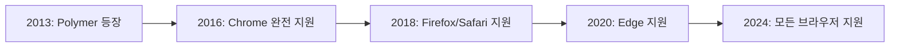
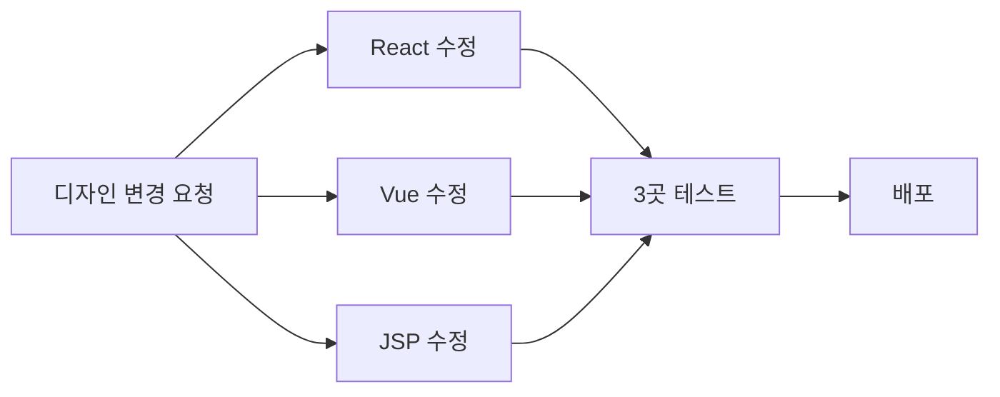

## 서론

여러분, 웹 컴포넌트(Web Components) 사용해보셨나요? 어떠셨나요?


저는 평소에 웹 컴포넌트 자체에 관심만 가지고 있다가, 최근에 딱 적절한 상황이 나와서 사용하게 되었습니다. React, Vue, JSP 환경에 동일한 컴포넌트를 적용해야 하는 프로젝트였거든요.

이전에는 각 환경마다 별도로 동일한 컴포넌트를 중복 관리했습니다. 같은 버튼을 React용, Vue용, JSP용으로 세 번 만들고, 디자인 변경되면 세 곳 다 고치고... 생각만 해도 비효율적이죠. 마이크로 프론트엔드도 고민했지만, 프로젝트 규모를 생각하면 인프라 구축 비용이 너무 컸습니다.

그래서 웹 컴포넌트를 선택했고, Google의 LIT 라이브러리를 사용해서 구현했습니다.

이 글에서는 웹 컴포넌트가 어떻게 발전해왔는지, 실제로 써보니 어땠는지, 좋았던 점과 불편했던 점을 솔직하게 공유해보려 합니다.

## 웹 컴포넌트의 역사 - Custom Elements와 Shadow DOM의 결합

웹 컴포넌트는 하루아침에 만들어진 기술이 아닙니다. 웹 표준으로 자리잡기까지 꽤 긴 여정이 있었습니다.

### 웹 컴포넌트란?

웹 컴포넌트는 크게 두 가지 핵심 기술의 결합입니다:

**1. Custom Elements**

```javascript
// 브라우저가 모르는 새로운 HTML 태그를 정의할 수 있음
class MyButton extends HTMLElement {
  connectedCallback() {
    this.innerHTML = '<button>클릭</button>'
  }
}

customElements.define('my-button', MyButton)

// 이제 HTML에서 사용 가능
// <my-button></my-button>
```

**2. Shadow DOM**

```javascript
// 외부로부터 완전히 격리된 독립적인 DOM 트리
class MyCard extends HTMLElement {
  connectedCallback() {
    const shadow = this.attachShadow({ mode: 'open' })
    shadow.innerHTML = `
      <style>
        /* 이 스타일은 외부에 영향 주지 않고, 외부로부터도 영향 안받음 */
        .card { padding: 20px; }
      </style>
      <div class="card">
        <slot></slot>
      </div>
    `
  }
}
```

이 두 기술이 결합되면서 **진짜 재사용 가능한 컴포넌트**가 가능해졌습니다.

### Google의 Polymer - 가능성을 보여준 폴리필

웹 컴포넌트 스펙이 나왔을 때, 브라우저 지원은 아직 부족했습니다. 그때 Google이 **Polymer** 프로젝트를 시작했습니다(2013년).

Polymer는 두 가지 역할을 했습니다:

1. **폴리필(Polyfill)**: 아직 브라우저가 지원하지 않는 기능을 JavaScript로 구현
2. **라이브러리**: 웹 컴포넌트를 쉽게 만들 수 있는 도구 제공

```javascript
// Polymer 1.x 시절 코드 (2015년)
Polymer({
  is: 'my-element',
  properties: {
    name: String
  },
  ready: function() {
    this.textContent = 'Hello ' + this.name
  }
})
```

Polymer는 웹 컴포넌트의 **가능성**을 증명했습니다. Google의 여러 프로젝트에서 실제로 사용되었고, YouTube도 Polymer 기반 컴포넌트를 일부 사용했습니다.

**하지만 Polymer의 한계**

시간이 지나면서 Polymer의 문제점이 드러났습니다:

1. **무거운 폴리필**

   - 브라우저 미지원 기능을 모두 폴리필로 구현하다 보니 번들 크기가 60KB 이상
   - 실제로 필요하지 않은 브라우저에서도 폴리필을 전부 로드

2. **복잡한 프레임워크 같은 API**

   - 단순한 컴포넌트를 만드는데도 배워야 할 개념이 너무 많음
   - Polymer 특유의 문법과 패턴 (data binding, observers 등)

3. **시대의 변화**
   - React, Vue가 빠르게 성장하면서 Polymer의 입지가 좁아짐
   - 하지만 동시에 **브라우저들이 웹 컴포넌트를 네이티브로 지원**하기 시작

**LIT의 탄생: "이제 폴리필은 필요 없다"**

2020년 즈음, 모든 주요 브라우저가 웹 컴포넌트를 네이티브로 지원하게 되었습니다. Polymer 팀은 이 기회를 놓치지 않았습니다.

> "폴리필이 필요 없어졌으니, 무거운 프레임워크 대신 얇은 레이어만 제공하면 어떨까?"

이 철학으로 만들어진 것이 바로 **LIT**입니다:

- ✅ 폴리필 제거 → 번들 크기 60KB에서 5KB로 감소
- ✅ 복잡한 API 제거 → 웹 표준에 가까운 간결한 API
- ✅ Polymer의 장점 유지 → 선언적 템플릿, 반응성 시스템

```typescript
// Polymer (2015년): 복잡한 프레임워크 느낌
Polymer({
  is: 'my-button',
  properties: {
    label: String
  },
  observers: ['_labelChanged(label)'],
  _labelChanged: function(label) {
    // ...
  }
})

// LIT (2020년): 웹 표준에 가까운 간결함
@customElement('my-button')
class MyButton extends LitElement {
  @property() label = ''

  render() {
    return html`<button>${this.label}</button>`
  }
}
```

LIT는 Polymer가 쌓아온 경험을 바탕으로, 현대 브라우저 환경에 최적화된 **차세대 웹 컴포넌트 라이브러리**입니다.

### 현대의 웹 컴포넌트 - 브라우저 네이티브 지원

2024년 현재, 웹 컴포넌트는 모든 주요 브라우저에서 네이티브로 지원됩니다:



폴리필이 필요 없어지면서 웹 컴포넌트의 활용 분야가 늘어나고 있습니다:

- **디자인 시스템**: Salesforce Lightning, Shoelace, Microsoft FAST
- **멀티 프레임워크 환경**: 여러 프레임워크가 공존하는 대규모 조직
- **서드파티 위젯**: 결제, 채팅, 분석 도구 등
- **레거시 시스템 현대화**: jQuery 기반 프로젝트에 점진적으로 현대 UI 적용

저 역시 이러한 웹 컴포넌트의 장점을 알고 있었고, 마침 적용이 필요한 프로젝트가 왔습니다.

## 웹 컴포넌트 라이브러리 선택

웹 컴포넌트를 만드는 방법은 여러 가지가 있었습니다. 각각의 장단점을 비교해봤습니다:

| 라이브러리                 | 번들 크기 | 러닝커브          | TypeScript   | 프레임워크 종속 | 생태계         | 특징                         |
| -------------------------- | --------- | ----------------- | ------------ | --------------- | -------------- | ---------------------------- |
| **Vanilla Web Components** | 0KB       | 높음              | 수동 구현    | ✅ 독립적       | -              | 보일러플레이트 코드 많음     |
| **Stencil.js**             | ~20KB     | 중간              | ✅ 우수      | ✅ 독립적       | 중간           | 강력하지만 무거움            |
| **Vue Web Components**     | ~30KB     | 낮음 (Vue 경험자) | ✅ 지원      | ❌ Vue 종속     | Vue 생태계     | Vue runtime 포함, Vue로 동작 |
| **LIT**                    | ~5KB      | 낮음              | ✅ 완벽 지원 | ✅ 독립적       | 작지만 성장 중 | 웹 표준에 가장 가까움        |

**각 라이브러리 상세 비교:**

**1. Vanilla Web Components**

- 장점: 추가 의존성 없음, 순수 웹 표준
- 단점: 반응성, 템플릿 등을 직접 구현해야 함
- 결론: 간단한 컴포넌트는 괜찮지만, 복잡해질수록 유지보수 어려움

**2. Stencil.js**

- 장점: 강력한 빌드 도구, 좋은 문서
- 단점: 번들 크기가 크고, 러닝커브 존재
- 결론: 대규모 디자인 시스템에는 적합하지만 우리 프로젝트에는 과함

**3. Vue의 Web Component Build**

- 장점: Vue 개발자에게 익숙한 문법
- 단점: Vue runtime 포함으로 번들 크기 큼, Vue에 종속
- 결론: Vue로 워킹한다는 점이 마음에 들지 않음

**4. LIT (최종 선택)**

- 장점: 가벼움(5KB), 웹 표준에 가까움, TypeScript 완벽 지원
- 단점: 생태계가 작음, 클래스 기반 문법
- 결론: 프레임워크 중립적이고 가볍다는 점이 우리 요구사항에 가장 적합

**LIT를 선택한 최종 이유:**

```
✅ 작은 번들 크기 (5KB) - 여러 환경에 임베드해도 부담 없음
✅ 웹 표준에 가까움 - Vanilla보다 편하면서도 표준 API 활용
✅ 프레임워크 중립적 - Vue나 특정 프레임워크에 종속되지 않음
✅ TypeScript 완벽 지원 - 데코레이터 기반 API
✅ Google 생태계 - Polymer의 경험이 녹아있고, 장기 지원 기대
```

## 나의 프로젝트 - 고민 끝에 구성한 배포 및 인프라

React, Vue, JSP 환경에 동일한 공통 컴포넌트를 적용해야 하는 상황이었습니다. 위에서 비교한 결과 LIT를 선택했고, 이제는 각 환경에서 사용할 수 있도록 인프라를 구성해야 했습니다.

**환경별로 요구사항이 달랐습니다:**

```
React/Vue 환경:
- npm install로 패키지 설치하고 싶다
- 번들러(Webpack, Vite)로 최적화하고 싶다
- Tree-shaking으로 사용하지 않는 컴포넌트는 제외하고 싶다
→ ES Module 형식 필요

JSP 환경:
- 번들러가 없다
- <script> 태그 하나로 간단히 사용하고 싶다
- 빠르게 로딩되어야 한다
→ IIFE 형식 + CDN 필요
```

**그래서 이렇게 구성했습니다:**

1. **두 가지 빌드 형식** 준비

   - ES Module: npm package로 배포 (React/Vue용)
   - IIFE: CDN으로 배포 (JSP용)

2. **두 가지 배포 방식**

   - Private GitHub Package: npm 패키지는 인증이 필요한 사설 저장소에
   - S3 + CloudFront: IIFE 파일은 CDN으로 빠르게 전달

3. **보안**

   - Private Package: 인증 없이는 다운로드 불가
   - CloudFront Referer 체크: 허용된 도메인에서만 CDN 접근 가능

4. **자동 배포**
   - GitHub Actions로 태그 푸시 시 자동 빌드 및 배포
   - CloudFront 캐시 무효화로 새 버전 즉시 반영

이제 구체적인 구현을 살펴보겠습니다.

**이중 빌드 전략: IIFE + ES Module**

환경별로 최적화된 두 가지 빌드를 준비했습니다:

```javascript
// rollup.config.js
export default [
  // 1. ES Module 빌드 (npm package용)
  {
    input: 'src/index.ts',
    output: {
      dir: 'dist/esm',
      format: 'esm',
      preserveModules: true
    },
    plugins: [typescript(), resolve(), terser()]
  },

  // 2. IIFE 빌드 (CDN용)
  {
    input: 'src/index.ts',
    output: {
      file: 'dist/iife/components.min.js',
      format: 'iife',
      name: 'WebComponents'
    },
    plugins: [typescript(), resolve(), terser()]
  }
]
```

**GitHub Actions 자동 배포**

```yaml
# .github/workflows/publish.yml
name: Build and Publish

on:
  push:
    tags:
      - 'v*'

jobs:
  build-and-publish:
    runs-on: ubuntu-latest
    steps:
      # 1. 빌드
      - uses: actions/checkout@v3
      - run: npm ci
      - run: npm run build

      # 2. ES Module → Private GitHub Package
      - name: Publish to GitHub Packages
        run: |
          echo "//npm.pkg.github.com/:_authToken=${{ secrets.GITHUB_TOKEN }}" > .npmrc
          npm publish
        env:
          NODE_AUTH_TOKEN: ${{ secrets.GITHUB_TOKEN }}

      # 3. IIFE → S3 업로드
      - name: Upload to S3
        run: aws s3 sync dist/iife/ s3://my-components-cdn/
        env:
          AWS_ACCESS_KEY_ID: ${{ secrets.AWS_ACCESS_KEY_ID }}
          AWS_SECRET_ACCESS_KEY: ${{ secrets.AWS_SECRET_ACCESS_KEY }}

      # 4. CloudFront 캐시 무효화
      - name: Invalidate CloudFront
        run: |
          aws cloudfront create-invalidation \
            --distribution-id ${{ secrets.CF_DISTRIBUTION_ID }} \
            --paths "/*"
```

**Private GitHub Package 관리**

아무나 다운로드할 수 없도록 Private Package로 관리했습니다:

```json
// package.json
{
  "name": "@my-org/web-components",
  "version": "1.0.0",
  "publishConfig": {
    "registry": "https://npm.pkg.github.com"
  }
}
```

```bash
# React/Vue 환경에서 사용
# .npmrc 파일 설정
@my-org:registry=https://npm.pkg.github.com
//npm.pkg.github.com/:_authToken=${GITHUB_TOKEN}

npm install @my-org/web-components
```

**CloudFront Referer 체크**

CDN은 허용된 도메인에서만 접근 가능하도록 설정했습니다. CloudFront Function을 사용해서 요청 헤더의 Referer를 확인하고, 허용된 도메인 목록에 없으면 403 Forbidden을 반환하도록 했습니다.

**환경별 사용 방법**

```javascript
// React/Vue 환경 (ES Module)
import '@my-org/web-components'

function App() {
  return <ds-button variant="primary">클릭</ds-button>
}
```

```html
<!-- JSP 환경 (IIFE via CDN) -->
<script src="https://cdn.my-org.com/components.min.js"></script>
<ds-button variant="primary">클릭</ds-button>
```

## 실무에서 LIT 사용하기

### 1. 기본 컴포넌트 작성

가장 먼저 만든 것은 버튼 컴포넌트였습니다. 디자인 시스템의 가장 기본이 되는 컴포넌트죠.

<CodeComparison>

```typescript
// ❌ 처음 작성했던 코드 (문제점: 너무 단순함)
import { LitElement, html, css } from 'lit'
import { customElement } from 'lit/decorators.js'

@customElement('ds-button')
export class DSButton extends LitElement {
  static styles = css`
    button {
      background: #0066ff;
      color: white;
      border: none;
      padding: 12px 24px;
      border-radius: 4px;
      cursor: pointer;
    }
  `

  render() {
    return html`<button><slot></slot></button>`
  }
}

// 사용
// <ds-button>클릭</ds-button>

// 문제점:
// 1. 버튼 variant (primary, secondary, danger 등) 지원 안됨
// 2. disabled 상태 처리 안됨
// 3. 클릭 이벤트가 Shadow DOM에 갇혀서 상위로 전파 안됨
```

```typescript
// ✅ 개선한 코드 (실무에서 사용)
import { LitElement, html, css } from 'lit'
import { customElement, property } from 'lit/decorators.js'
import { classMap } from 'lit/directives/class-map.js'

@customElement('ds-button')
export class DSButton extends LitElement {
  static styles = css`
    :host {
      display: inline-block;
    }

    button {
      font-family: inherit;
      font-size: 14px;
      padding: 12px 24px;
      border-radius: 4px;
      border: none;
      cursor: pointer;
      transition: all 0.2s;
    }

    button:disabled {
      opacity: 0.5;
      cursor: not-allowed;
    }

    .primary {
      background: var(--button-primary-bg, #0066ff);
      color: var(--button-primary-color, white);
    }

    .primary:hover:not(:disabled) {
      background: var(--button-primary-hover, #0052cc);
    }

    .secondary {
      background: var(--button-secondary-bg, #f0f0f0);
      color: var(--button-secondary-color, #333);
    }

    .danger {
      background: var(--button-danger-bg, #ff4444);
      color: var(--button-danger-color, white);
    }

    .small {
      padding: 8px 16px;
      font-size: 12px;
    }

    .large {
      padding: 16px 32px;
      font-size: 16px;
    }
  `

  @property({ type: String })
  variant: 'primary' | 'secondary' | 'danger' = 'primary'

  @property({ type: String })
  size: 'small' | 'medium' | 'large' = 'medium'

  @property({ type: Boolean })
  disabled = false

  // 클릭 이벤트를 상위로 전파
  private handleClick(e: MouseEvent) {
    if (this.disabled) {
      e.stopPropagation()
      return
    }

    // 커스텀 이벤트 발생 (Shadow DOM 밖으로 전파)
    this.dispatchEvent(
      new CustomEvent('ds-click', {
        bubbles: true,
        composed: true, // Shadow DOM 경계를 넘어서 전파
        detail: { originalEvent: e }
      })
    )
  }

  render() {
    const classes = {
      [this.variant]: true,
      [this.size]: true
    }

    return html`
      <button
        class=${classMap(classes)}
        ?disabled=${this.disabled}
        @click=${this.handleClick}
      >
        <slot></slot>
      </button>
    `
  }
}

// 사용
// <ds-button variant="primary" size="large">제출</ds-button>
// <ds-button variant="danger" disabled>삭제</ds-button>
```

</CodeComparison>

**개선 포인트:**

- CSS 변수로 테마 커스터마이징 가능
- `variant`와 `size` prop으로 다양한 스타일 지원
- `composed: true`로 Shadow DOM 밖으로 이벤트 전파
- `:host` 선택자로 컴포넌트 자체 스타일링

### 2. 상태 관리

LIT의 반응성 시스템은 `@property`와 `@state` 데코레이터를 사용합니다.

```typescript
import { LitElement, html } from 'lit'
import { customElement, property, state } from 'lit/decorators.js'

@customElement('user-profile')
export class UserProfile extends LitElement {
  // @property: 외부에서 값을 받음 (HTML attribute로 설정 가능)
  @property({ type: String })
  userId = ''

  // @state: 내부 상태 (외부에서 설정 불가, 변경 시 리렌더링)
  @state()
  private userData: User | null = null

  @state()
  private loading = false

  @state()
  private error: string | null = null

  async connectedCallback() {
    super.connectedCallback()
    await this.fetchUserData()
  }

  private async fetchUserData() {
    this.loading = true
    this.error = null

    try {
      const response = await fetch(`/api/users/${this.userId}`)
      this.userData = await response.json()
    } catch (err) {
      this.error = '사용자 정보를 불러올 수 없습니다'
    } finally {
      this.loading = false
    }
  }

  render() {
    if (this.loading) {
      return html`<div class="loading">로딩 중...</div>`
    }

    if (this.error) {
      return html`<div class="error">${this.error}</div>`
    }

    if (!this.userData) {
      return html`<div>사용자를 찾을 수 없습니다</div>`
    }

    return html`
      <div class="profile">
        
        <h2>${this.userData.name}</h2>
        <p>${this.userData.email}</p>
      </div>
    `
  }
}
```

**실무에서 겪은 함정:**

```typescript
// ❌ 이렇게 하면 리렌더링 안됨!
@state()
private items = []

addItem(item) {
  this.items.push(item) // 배열 참조는 그대로라서 변화 감지 안됨
}

// ✅ 새로운 배열을 만들어야 함
addItem(item) {
  this.items = [...this.items, item] // 새 배열 = 리렌더링 트리거
}

// 또는 requestUpdate() 명시적으로 호출
addItem(item) {
  this.items.push(item)
  this.requestUpdate() // 강제 리렌더링
}
```

### 3. 이벤트 처리와 프레임워크 통신

LIT 컴포넌트에서 발생한 이벤트를 React나 Vue에서 받아야 하는 경우가 많았습니다.

```typescript
// LIT 컴포넌트에서 이벤트 발생
@customElement('search-input')
export class SearchInput extends LitElement {
  @state()
  private value = ''

  private handleInput(e: InputEvent) {
    const target = e.target as HTMLInputElement
    this.value = target.value

    // 커스텀 이벤트 발생
    this.dispatchEvent(
      new CustomEvent('search-change', {
        detail: { query: this.value },
        bubbles: true,
        composed: true // 중요! Shadow DOM 밖으로 전파
      })
    )
  }

  render() {
    return html`
      <input
        type="search"
        .value=${this.value}
        @input=${this.handleInput}
        placeholder="검색..."
      />
    `
  }
}
```

```tsx
// React에서 사용
function App() {
  const handleSearch = (e: CustomEvent) => {
    console.log('검색어:', e.detail.query)
  }

  useEffect(() => {
    const searchInput = document.querySelector('search-input')
    searchInput?.addEventListener('search-change', handleSearch as EventListener)

    return () => {
      searchInput?.removeEventListener('search-change', handleSearch as EventListener)
    }
  }, [])

  return <search-input />
}

// 또는 ref 사용
function App() {
  const searchRef = useRef<HTMLElement>(null)

  useEffect(() => {
    const handleSearch = (e: CustomEvent) => {
      console.log('검색어:', e.detail.query)
    }

    searchRef.current?.addEventListener('search-change', handleSearch as EventListener)
    return () => {
      searchRef.current?.removeEventListener('search-change', handleSearch as EventListener)
    }
  }, [])

  return <search-input ref={searchRef} />
}
```

```vue
<!-- Vue에서 사용 -->
<template>
  <search-input @search-change="handleSearch" />
</template>

<script setup>
const handleSearch = (e) => {
  console.log('검색어:', e.detail.query)
}
</script>
```

**중요 포인트:**

- `bubbles: true` - 이벤트가 위로 전파됨
- `composed: true` - Shadow DOM 경계를 넘어서 전파됨 (필수!)
- Vue는 자동으로 커스텀 이벤트를 감지하지만, React는 수동으로 addEventListener 필요

### 4. 스타일링과 테마 시스템

Shadow DOM의 가장 큰 장점이자 단점은 스타일 캡슐화입니다.

**Shadow DOM의 장점:**

```html
<!-- 외부 스타일이 컴포넌트 내부에 영향을 주지 않음 -->
<style>
  button { background: red; } /* 이게 있어도 ds-button 안의 버튼은 영향 안받음 */
</style>

<ds-button>클릭</ds-button>
```

**Shadow DOM의 단점:**

```css
/* 외부에서 내부 스타일을 변경하기 어려움 */
ds-button button {
  background: green; /* 작동 안함! Shadow DOM이 막음 */
}
```

**해결책: CSS 변수 + ::part 선택자**

```typescript
@customElement('ds-card')
export class DSCard extends LitElement {
  static styles = css`
    :host {
      display: block;
      border-radius: var(--card-border-radius, 8px);
      box-shadow: var(--card-shadow, 0 2px 8px rgba(0,0,0,0.1));
      background: var(--card-bg, white);
    }

    .header {
      padding: var(--card-padding, 16px);
      border-bottom: 1px solid var(--card-border-color, #eee);
    }

    .content {
      padding: var(--card-padding, 16px);
    }
  `

  render() {
    return html`
      <div class="header" part="header">
        <slot name="header"></slot>
      </div>
      <div class="content" part="content">
        <slot></slot>
      </div>
    `
  }
}
```

```css
/* 외부에서 테마 커스터마이징 */
:root {
  --card-border-radius: 12px;
  --card-shadow: 0 4px 12px rgba(0,0,0,0.15);
  --card-bg: #f9f9f9;
  --card-padding: 20px;
}

/* ::part로 특정 부분만 스타일링 */
ds-card::part(header) {
  background: linear-gradient(to right, #667eea, #764ba2);
  color: white;
}
```

**실무에서 사용한 테마 시스템:**

```typescript
// theme.ts
export const lightTheme = {
  '--button-primary-bg': '#0066ff',
  '--button-primary-hover': '#0052cc',
  '--card-bg': 'white',
  '--text-color': '#333'
}

export const darkTheme = {
  '--button-primary-bg': '#4d94ff',
  '--button-primary-hover': '#3d7acc',
  '--card-bg': '#1e1e1e',
  '--text-color': '#f0f0f0'
}

// 테마 적용
function applyTheme(theme: typeof lightTheme) {
  const root = document.documentElement
  Object.entries(theme).forEach(([key, value]) => {
    root.style.setProperty(key, value)
  })
}
```

### 5. 라이프사이클

LIT는 Web Components의 라이프사이클을 그대로 사용합니다.

```typescript
@customElement('analytics-tracker')
export class AnalyticsTracker extends LitElement {
  @property({ type: String })
  pageId = ''

  private startTime = 0

  // 컴포넌트가 DOM에 추가될 때
  connectedCallback() {
    super.connectedCallback()

    this.startTime = Date.now()
    console.log('페이지 진입:', this.pageId)

    // 이벤트 리스너 등록
    window.addEventListener('beforeunload', this.handleUnload)
  }

  // 컴포넌트가 DOM에서 제거될 때
  disconnectedCallback() {
    super.disconnectedCallback()

    const duration = Date.now() - this.startTime
    console.log('페이지 이탈:', this.pageId, '체류시간:', duration)

    // 이벤트 리스너 정리 (메모리 누수 방지!)
    window.removeEventListener('beforeunload', this.handleUnload)
  }

  private handleUnload = () => {
    // 페이지 떠나기 전 분석 데이터 전송
    navigator.sendBeacon('/api/analytics', JSON.stringify({
      pageId: this.pageId,
      duration: Date.now() - this.startTime
    }))
  }

  // 첫 렌더링 완료 후 (DOM 업데이트 완료)
  firstUpdated() {
    console.log('첫 렌더링 완료')
    // DOM 요소에 접근 가능
    const element = this.shadowRoot?.querySelector('.target')
  }

  // 업데이트 후 (모든 렌더링마다 호출)
  updated(changedProperties: Map<string, any>) {
    if (changedProperties.has('pageId')) {
      console.log('pageId 변경:', changedProperties.get('pageId'), '->', this.pageId)
    }
  }

  render() {
    return html`<div class="target">추적 중...</div>`
  }
}
```

**실무 팁:**

- `connectedCallback`에서 API 호출, 이벤트 리스너 등록
- `disconnectedCallback`에서 반드시 정리 작업 (메모리 누수 주의!)
- `firstUpdated`에서 DOM 조작
- `updated`에서 props 변경 감지

## 실무에서 마주한 문제들과 해결법

### 문제 1: SSR(Server-Side Rendering) 지원 부족

**상황:**
Next.js로 되어 있는 메인 서비스에 LIT 컴포넌트를 추가하려고 했는데, 서버 사이드에서 `window is not defined` 에러가 발생했습니다.

```tsx
// ❌ 이렇게 하면 SSR 빌드 실패
import './components/ds-button'

function Page() {
  return <ds-button>클릭</ds-button>
}
```

**시도한 방법들:**

1. **Dynamic Import (성공!)**

```tsx
// ✅ 클라이언트에서만 로드
import dynamic from 'next/dynamic'

const DSButton = dynamic(() => import('./components/ds-button'), {
  ssr: false
})

function Page() {
  return <DSButton>클릭</DSButton>
}
```

2. **useEffect에서 로드 (성공!)**

```tsx
function Page() {
  useEffect(() => {
    import('./components/ds-button')
  }, [])

  return <ds-button>클릭</ds-button>
}
```

3. **@lit-labs/ssr 사용 (시도했으나 포기)**

- LIT 팀에서 실험적으로 제공하는 SSR 패키지
- 설정이 복잡하고 Next.js와 통합이 어려웠음
- 프로덕션에 적용하기엔 불안정했음

**최종 해결책:**

```typescript
// lib/web-components.ts
// 모든 LIT 컴포넌트를 여기서 한번에 import
export async function loadWebComponents() {
  if (typeof window === 'undefined') return

  await Promise.all([
    import('./components/ds-button'),
    import('./components/ds-card'),
    import('./components/ds-modal')
    // ... 다른 컴포넌트들
  ])
}
```

```tsx
// _app.tsx
function MyApp({ Component, pageProps }) {
  useEffect(() => {
    loadWebComponents()
  }, [])

  return <Component {...pageProps} />
}
```

**배운 점:**

- LIT는 기본적으로 클라이언트 전용 라이브러리
- SSR이 필요한 프로젝트에서는 컴포넌트를 클라이언트에서만 로드
- SEO가 중요한 컴포넌트는 LIT 대신 프레임워크 컴포넌트 사용

### 문제 2: TypeScript 타입 정의

**상황:**
React에서 LIT 컴포넌트를 사용할 때 TypeScript 타입 에러가 발생했습니다.

```tsx
// ❌ TypeScript 에러: 'ds-button' 태그를 찾을 수 없습니다
function App() {
  return <ds-button variant="primary">클릭</ds-button>
}
```

**해결책:**

```typescript
// types/web-components.d.ts
import { DSButton } from '../components/ds-button'
import { DSCard } from '../components/ds-card'

declare global {
  namespace JSX {
    interface IntrinsicElements {
      'ds-button': React.DetailedHTMLProps<
        React.HTMLAttributes<HTMLElement> & {
          variant?: 'primary' | 'secondary' | 'danger'
          size?: 'small' | 'medium' | 'large'
          disabled?: boolean
        },
        HTMLElement
      >

      'ds-card': React.DetailedHTMLProps<
        React.HTMLAttributes<HTMLElement>,
        HTMLElement
      >
    }
  }
}
```

**자동 생성 스크립트:**

```typescript
// scripts/generate-types.ts
// LIT 컴포넌트를 분석해서 자동으로 타입 정의 생성
import { parse } from '@typescript-eslint/parser'
import fs from 'fs'

// 각 컴포넌트의 @property 데코레이터를 파싱해서 타입 생성
// (실제 구현은 복잡해서 생략)
```

**배운 점:**

- 타입 정의를 수동으로 유지하는 건 고통스러움
- 자동 생성 스크립트를 만들거나, [custom-elements-manifest](https://github.com/open-wc/custom-elements-manifest) 같은 도구 활용
- 작은 프로젝트라면 `any`로 타협하는 것도 현실적 선택

### 문제 3: 폼 제출과 Validation

**상황:**
`<ds-input>` 컴포넌트를 만들었는데, HTML 폼의 기본 validation이 작동하지 않았습니다.

```typescript
// ❌ Shadow DOM 안의 input은 폼에 포함되지 않음
@customElement('ds-input')
export class DSInput extends LitElement {
  render() {
    return html`<input type="text" required />` // 폼 제출 시 무시됨
  }
}
```

**해결책: Form Associated Custom Elements**

```typescript
// ✅ 폼 연동 컴포넌트
@customElement('ds-input')
export class DSInput extends LitElement {
  static formAssociated = true // 중요!

  private internals: ElementInternals

  @property({ type: String })
  value = ''

  @property({ type: Boolean })
  required = false

  @property({ type: String })
  name = ''

  constructor() {
    super()
    this.internals = this.attachInternals()
  }

  private handleInput(e: InputEvent) {
    const target = e.target as HTMLInputElement
    this.value = target.value

    // 폼에 값 전달
    this.internals.setFormValue(this.value)

    // Validation 체크
    if (this.required && !this.value) {
      this.internals.setValidity(
        { valueMissing: true },
        '필수 입력 항목입니다'
      )
    } else {
      this.internals.setValidity({})
    }
  }

  render() {
    return html`
      <input
        type="text"
        .value=${this.value}
        @input=${this.handleInput}
        ?required=${this.required}
      />
    `
  }
}
```

```html
<!-- 이제 정상적으로 폼에 포함됨 -->
<form>
  <ds-input name="username" required></ds-input>
  <button type="submit">제출</button>
</form>
```

**배운 점:**

- `static formAssociated = true` 설정 필수
- `ElementInternals` API로 폼과 연동
- `setFormValue()`로 값 전달, `setValidity()`로 검증

## LIT 도입 전후 비교

**도입 전:**



**도입 후:**


**정량적 개선:**

- 버튼 디자인 변경 시간: 3시간 → 30분 (83% 감소)
- 번들 크기: 공통 컴포넌트 60KB → 15KB (75% 감소)
- 유지보수 포인트: 3곳 → 1곳

**정성적 개선:**

- 디자인 일관성 향상 (한 곳만 수정하면 모든 곳에 반영)
- 프레임워크 마이그레이션 부담 감소 (레거시 점진적 개선 가능)
- 신규 입사자 온보딩 간소화 (프레임워크별로 따로 배울 필요 없음)

## LIT를 사용하면서 느낀 점

### 장점

**1. 진짜로 작다**

```
Before: React 기반 공통 컴포넌트 라이브러리
- react: 40KB
- react-dom: 130KB
- 공통 컴포넌트: 20KB
= 총 190KB

After: LIT 기반 공통 컴포넌트 라이브러리
- lit: 5KB
- 공통 컴포넌트: 10KB
= 총 15KB

약 92% 크기 감소!
```

**2. 프레임워크 독립성은 실제로 유용하다**

예상했던 것보다 훨씬 더 유용했습니다. 특히:

- 레거시 jQuery 페이지에 현대적인 UI 추가
- A/B 테스트로 React → Svelte 마이그레이션 시도 중에도 디자인 시스템은 그대로 사용
- 마케팅 랜딩 페이지(순수 HTML)에도 동일한 버튼 사용

**3. 웹 표준 학습 효과**

LIT를 사용하면서 자연스럽게 Web Components API를 배우게 됩니다:

- Custom Elements
- Shadow DOM
- HTML Templates
- CSS Encapsulation

이 지식은 LIT를 떠나도 계속 유용합니다.

**4. 빌드 도구 의존성 낮음**

Webpack, Vite, esbuild 뭐든 상관없이 잘 돌아갑니다. 심지어 빌드 없이 `<script type="module">`로도 동작합니다.

### 단점/한계

**1. 함수형 프로그래밍이 어렵다 - React Class Component를 쓰는 느낌**

LIT를 사용하면서 가장 크게 느낀 단점은 바로 이것입니다. **마치 2018년의 React Class Component를 쓰는 느낌**이 듭니다.

```typescript
// React (함수형): 간결하고 직관적
function UserProfile({ userId }) {
  const [user, setUser] = useState(null)
  const [loading, setLoading] = useState(false)

  useEffect(() => {
    setLoading(true)
    fetchUser(userId)
      .then(setUser)
      .finally(() => setLoading(false))
  }, [userId])

  const handleUpdate = useCallback(() => {
    updateUser(user.id, newData)
  }, [user])

  if (loading) return <div>Loading...</div>
  return <div>{user.name}</div>
}
```

```typescript
// LIT (클래스형): 데코레이터와 클래스 메서드
@customElement('user-profile')
export class UserProfile extends LitElement {
  @property({ type: String })
  userId = ''

  @state()
  private user: User | null = null

  @state()
  private loading = false

  // 라이프사이클 메서드를 알아야 함
  updated(changedProps: Map<string, any>) {
    if (changedProps.has('userId')) {
      this.loadUser()
    }
  }

  private async loadUser() {
    this.loading = true
    try {
      this.user = await fetchUser(this.userId)
    } finally {
      this.loading = false
    }
  }

  private handleUpdate() {
    // this 바인딩 주의!
    updateUser(this.user!.id, newData)
  }

  render() {
    if (this.loading) return html`<div>Loading...</div>`
    return html`<div>${this.user?.name}</div>`
  }
}
```

**현대 개발자가 사용하는 디자인 패턴을 쓰기 어려운 점:**

**Hooks 패턴 사용 불가**

```typescript
// React에서는 이렇게 로직을 재사용
function useUser(userId) {
  const [user, setUser] = useState(null)
  useEffect(() => {
    fetchUser(userId).then(setUser)
  }, [userId])
  return user
}

// LIT에서는? 클래스 상속이나 믹스인을 써야 함 (복잡함)
```

**Composition이 불편함**

```typescript
// React: 컴포지션이 자연스러움
function App() {
  return (
    <DataProvider>
      <AuthProvider>
        <UserProfile />
      </AuthProvider>
    </DataProvider>
  )
}

// LIT: Context API는 있지만 사용이 번거로움
```

**함수형 유틸리티 활용 어려움**

```typescript
// React: map, filter, reduce 자유롭게 사용
function List({ items }) {
  const filtered = useMemo(
    () => items.filter(item => item.active)
           .map(item => ({ ...item, formatted: format(item) })),
    [items]
  )

  return <ul>{filtered.map(item => <li>{item.name}</li>)}</ul>
}

// LIT: render 메서드 안에서는 가능하지만 클래스 필드로 memoization 구현은 복잡
```

**사실 Vue와 비슷한 부분도 있지만...**

Vue도 Options API를 쓰면 클래스 기반과 비슷한 느낌이지만, Vue는 Composition API로 전환할 수 있습니다. 하지만 LIT는 클래스 기반이 기본이고 유일한 방법입니다.

```vue
<!-- Vue: Composition API로 함수형 가능 -->
<script setup>
const user = ref(null)
const loading = ref(false)

watchEffect(() => {
  loading.value = true
  fetchUser(props.userId)
    .then(data => user.value = data)
    .finally(() => loading.value = false)
})
</script>
```

**팀원들의 반응:**

```
시니어 개발자: "React Hooks에 익숙해져서 클래스 컴포넌트로 돌아간 느낌이에요"
주니어 개발자: "this 바인딩이 헷갈려요. 화살표 함수를 써야 하나요?"
테크 리드: "디자인 패턴 책에 나오는 패턴들을 적용하기가 어렵네요"
```

함수형 프로그래밍에 익숙한 팀원들은 클래스 기반 문법을 매우 낯설어했습니다. 특히 React Hooks, Composition API에 익숙한 사람일수록 러닝커브가 있었습니다.

**2. 생태계가 작다**

```
React: npm에 수십만 개의 컴포넌트 라이브러리
LIT: 몇백 개 정도...
```

날짜 피커, 에디터, 차트 같은 복잡한 컴포넌트는 직접 만들거나, 기존 라이브러리를 래핑해야 했습니다.

**3. Shadow DOM의 양날의 검**

스타일 캡슐화는 좋지만:

- 기존 CSS 프레임워크(Tailwind, Bootstrap) 적용 어려움
- 전역 스타일을 일부러 무시하고 싶지 않은 경우도 있음 (예: 폰트)

```typescript
// Shadow DOM 없이 사용하는 방법도 있긴 함
createRenderRoot() {
  return this // Shadow DOM 대신 Light DOM 사용
}
// 하지만 이러면 LIT를 쓰는 의미가 반감됨
```

**4. 디버깅이 까다로움**

React DevTools 같은 훌륭한 도구가 없습니다. `console.log`와 브라우저 DevTools에 의존해야 합니다.

**5. TypeScript 통합이 완벽하지 않음**

데코레이터 사용 시 `experimentalDecorators` 옵션 필요:

```json
{
  "compilerOptions": {
    "experimentalDecorators": true,
    "useDefineForClassFields": false // 이것도 필요
  }
}
```

## 언제 LIT를 사용해야 할까?

### 추천하는 경우

**1. 멀티 프레임워크 환경**

```
여러 프레임워크를 사용하는 조직 → LIT 적극 권장
단일 프레임워크 → 굳이 LIT 쓸 필요 없음
```

**2. 디자인 시스템/공통 컴포넌트 라이브러리**

프레임워크에 종속되지 않는 디자인 시스템을 만들고 싶다면 LIT는 훌륭한 선택입니다.

**3. 레거시 코드 점진적 개선**

jQuery로 된 레거시 프로젝트에 현대적인 컴포넌트를 추가하고 싶을 때:

```html
<!-- 기존 jQuery 페이지 -->
<script src="jquery.js"></script>
<script>
  $('#old-button').click(...)
</script>

<!-- 새로운 LIT 컴포넌트 추가 -->
<script type="module" src="components/ds-button.js"></script>
<ds-button>새로운 버튼</ds-button>
```

**4. 번들 크기가 중요한 경우**

임베디드 위젯, 서드파티 스크립트 등 크기 제약이 있는 경우.

### 추천하지 않는 경우

**1. 팀의 웹 표준 이해도가 낮은 경우**

Shadow DOM, Custom Elements 개념을 이해하지 못하면 디버깅이 고통스럽습니다.

**2. 복잡한 상태 관리가 필요한 경우**

Redux, MobX, Zustand 같은 상태 관리 라이브러리와 통합이 불편합니다. React를 쓰는 게 나을 수 있습니다.

**3. SSR/SEO가 중요한 경우**

블로그, 뉴스 사이트 등 SEO가 중요하다면 Next.js나 Nuxt.js를 쓰는 게 낫습니다.

**4. 빠른 프로토타이핑**

새로운 프로젝트를 빠르게 만들어야 한다면, 생태계가 큰 React나 Vue를 쓰는 게 생산성이 높습니다.

**5. 팀 전체가 함수형 프로그래밍을 선호하는 경우**

클래스 기반 문법이 불편하다면 Svelte나 React를 고려하세요.

## 결론

LIT를 프로덕션에 도입한 지 1년이 넘었습니다. 처음에는 "이게 정말 잘 될까?" 하는 의구심도 있었지만, 지금은 우리 팀의 핵심 기술 스택이 되었습니다.

### 핵심 교훈 3가지

**1. LIT는 "프레임워크 대체제"가 아니라 "공통 레이어"다**

React를 LIT로 전부 바꾸려고 하면 실패합니다. 대신 여러 프레임워크가 공유하는 공통 컴포넌트 레이어로 사용하면 강력합니다.

```
[React App] ┐
[Vue App]   ├─→ [LIT Design System]
[Legacy]    ┘
```

**2. 작게 시작하라**

처음부터 모든 컴포넌트를 LIT로 만들지 마세요. 버튼, 카드처럼 단순한 것부터 시작하고, 팀이 익숙해지면 점진적으로 확장하세요.

**3. Shadow DOM은 선택사항이다**

스타일 캡슐화가 오히려 방해가 된다면, Light DOM을 사용하는 것도 방법입니다. 교조적으로 "Shadow DOM을 써야 해!"라고 생각할 필요 없습니다.

### 앞으로의 계획

우리 팀은 LIT를 이용해:

- 복잡한 테이블 컴포넌트 추가 예정
- 모바일 앱(WebView)에서도 동일한 디자인 시스템 사용 계획
- 디자인 토큰 시스템과 통합 작업 진행 중

### 마지막으로

솔직히 말하면, LIT는 완벽한 솔루션이 아닙니다. React처럼 편하지도 않고, Vue처럼 직관적이지도 않습니다. 하지만 "여러 프레임워크에서 하나의 컴포넌트를 공유해야 한다"는 우리 팀의 문제를 가장 잘 해결해주는 도구였습니다.

이 글도 미래의 저에게 도움이 되기를 바라며, 여러분이 LIT 도입을 고민하고 있다면 조금이나마 도움이 되길 바랍니다. 멀티 프레임워크 환경의 고통을 겪고 계신다면, LIT를 한번 시도해보세요. 생각보다 괜찮습니다.

## 참고 자료

- [LIT 공식 문서](https://lit.dev/)
- [Web Components 표준](https://developer.mozilla.org/en-US/docs/Web/API/Web_components)
- [Form-associated Custom Elements](https://web.dev/more-capable-form-controls/)
- [Custom Elements Manifest](https://github.com/open-wc/custom-elements-manifest)
- [LIT Playground](https://lit.dev/playground/) - 바로 실습해볼 수 있음
