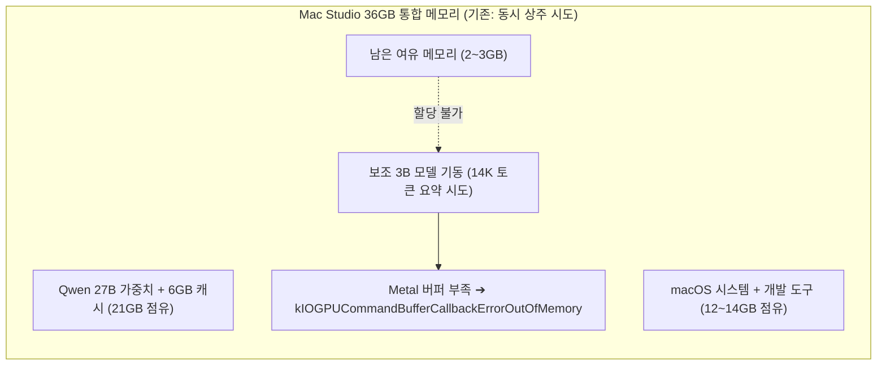
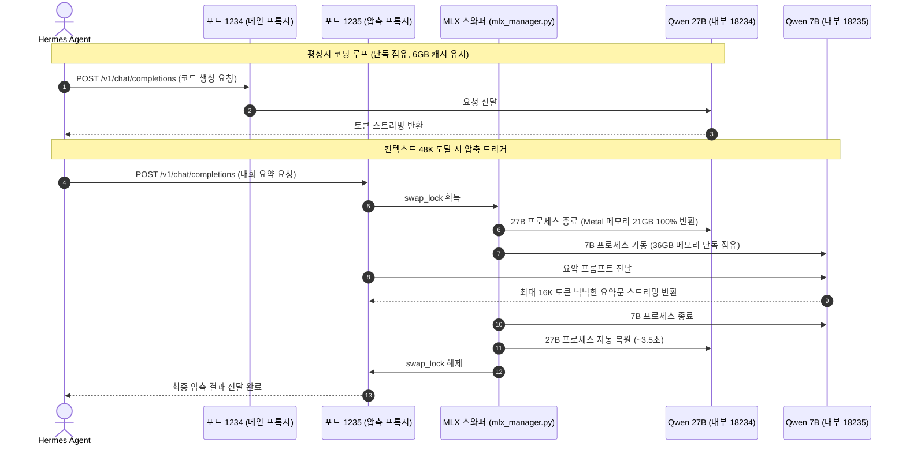

## 1. 현실적인 하드웨어와 로컬 AI의 벽

최근 로컬 환경에서 Hermes 같은 에이전트를 활용해 코딩 파이프라인을 구축해 쓰고 있습니다. 메인 코딩 모델로는 추론 성능이 좋은 Qwen 27B(4-bit)를 사용합니다.

제가 쓰는 머신은 Mac Studio (M5 Max, 통합 메모리 36GB) 기본형입니다.

<br />

```
Hardware Overview:
  Model Name: Mac Studio
  Chip: Apple M5 Max (18 Cores)
  Memory: 36 GB Unified Memory
```

<br />

64GB나 128GB로 CTO 주문을 했다면 편했겠지만, 하드웨어 옵션 비용이 만만치 않았습니다. 개발자로서 주어진 하드웨어 자원 안에서 답을 찾아보고 싶었습니다.

하지만 36GB 통합 메모리는 생각보다 타이트했습니다. 에이전트와 장시간 코딩 세션을 진행하다 보니 메모리 한계에 부딪혔습니다.

---

## 2. 27B와 3B 동시 상주, 그리고 Metal OOM

코딩용 LLM으로 긴 대화를 이어가며 빠른 응답 속도를 얻으려면 프롬프트 캐시(`--prompt-cache-bytes 6GB`)는 필수였습니다.

메모리를 계산해보면 이렇습니다:

* Qwen 27B 4bit 가중치: 약 15GB
* 27B 프롬프트 캐시: 6GB
* 시스템 OS, 브라우저, 개발 도구: 약 12~14GB
* 합치면 이미 33~35GB를 점유하고 있어서 잔여 메모리가 2~3GB 수준이었습니다.



이 상태에서 대화가 길어져 5만 토큰에 가까워지면, Hermes는 컨텍스트를 줄이기 위해 압축(compaction)을 실행합니다. 이전 대화 기록 수십~수백 턴을 보조 모델(당시에는 Qwen 2.5 3B)에 전달해 요약본으로 정리하는 작업입니다.

그리고 바로 여기서 문제가 발생했습니다.

```text
2026-10-04 19:33:26 - INFO - Prompt processing progress: 14294/14295
Exception in thread Thread-1 (_generate):
...
RuntimeError: [METAL] Command buffer execution failed: 
Insufficient Memory (00000008:kIOGPUCommandBufferCallbackErrorOutOfMemory).
```

요약해야 할 이전 대화(약 14,300 토큰)를 3B 모델이 GPU에 올리는 순간, 27B가 메모리를 쥐고 있어서 Metal GPU 버퍼 할당에 실패했습니다.

결국 MLX 서버의 생성 스레드가 비정상 종료되었고, Hermes는 응답을 기다리다 5분(300초) 타임아웃에 걸려 작업이 멈췄습니다.

---

## 3. 클라우드 API 임시 우회와 쿼터 고갈

처음에는 압축 작업만 Gemini Flash 같은 외부 클라우드 API로 넘겨서 급한 불을 껐습니다. Gemini를 쓰면 Mac 메모리를 쓰지 않으니 10만 토큰도 몇 초 만에 요약해줬습니다.

하지만 얼마 지나지 않아 쿼터 제한을 만났습니다.

```text
Gemini HTTP 429 (RESOURCE_EXHAUSTED): You exceeded your current quota.
* Quota exceeded for metric: generate_content_free_tier_requests
```

에이전트 특성상 파일 수정, 테스트, 명령 실행을 반복하다 보면 컨텍스트가 금방 차서 수시로 압축이 돕니다. 무료 API 티어는 몇 번의 턴 만에 소진되었습니다.

결국 외부 의존성을 없애고 100% 로컬 환경으로 문제를 해결해야 했습니다.

---

## 4. 동시 상주가 아니라 순차 실행

27B 캐시 6GB를 유지하면서 보조 모델도 죽지 않게 만들 방법을 고민하다가, 에이전트의 내부 라이프사이클을 다시 살펴봤습니다.

생각해보니 두 모델이 동시에 일할 필요가 전혀 없었습니다.

Hermes가 컨텍스트를 압축할 때 흐름을 보면 이렇습니다:

1. 대화가 임계치를 넘으면 메인 모델(27B)의 턴 진행이 멈춥니다.
2. 보조 모델이 이전 대화를 요약하는 동안 27B는 21GB 메모리만 차지한 채 대기합니다.
3. 보조 모델의 요약이 끝나면 비로소 27B가 요약본을 받아 다음 코딩 작업을 시작합니다.

완전히 순차적인(Sequential) 작업이었습니다.

게다가 Apple Silicon의 통합 메모리와 SSD 읽기 속도 덕분에 15GB 크기의 27B 모델을 내리고 다시 올리는 데 1초 안팎이면 충분했습니다.

답은 명확했습니다. 압축할 때는 27B를 잠시 내려서 Metal 메모리를 완전히 해제하고, 보조 모델이 36GB 전체를 여유롭게 써서 요약을 마친 뒤, 다시 27B를 불러오면 되는 문제였습니다.

---

## 5. MLX Dynamic Model Swapper 구축

이 아이디어를 바탕으로 Hermes와 MLX 서버 사이에 가벼운 비동기 프록시 매니저를 설계했습니다. 전체 파이썬 구현체는 GitHub 저장소 [deokgoo/mlx-dynamic-swapper](https://github.com/deokgoo/mlx-dynamic-swapper)의 [`mlx_manager.py`](https://github.com/deokgoo/mlx-dynamic-swapper/blob/main/mlx_manager.py)에서 확인하실 수 있습니다.



구현하면서 신경 쓴 세 가지 디테일입니다:

### 1. SIGSTOP 대신 완전한 프로세스 종료
처음에는 `SIGSTOP` 시그널로 27B를 일시정지시키면 어떨까 했습니다. 하지만 macOS Metal 프레임워크는 프로세스가 완전히 종료되지 않으면 통합 메모리(GPU 버퍼)를 반환하지 않습니다. 프로세스 그룹 전체를 깔끔하게 종료(`os.killpg`)해서 메모리를 0MB로 만들어야 했습니다.

### 2. 헬스체크 요청 바이패스
Hermes는 모델 생존 여부를 확인하기 위해 `GET /v1/models`를 수시로 호출합니다. 헬스체크 요청에도 모델을 교체하면 두 모델이 불필요하게 핑퐁을 치며 뻗게 됩니다. 그래서 헬스체크는 프로세스를 띄우지 않고 미리 캐싱된 JSON 메타데이터를 바로 반환하도록 처리했습니다.

### 3. 동시성 락(swap_lock)으로 502 에러 방지
보조 모델이 요약하는 몇 초 사이에 사용자의 추가 입력이 들어올 수 있습니다. 이때 27B 포트로 들어온 요청이 502 Bad Gateway 에러를 받으면 Hermes는 로컬 서버가 죽었다고 판단해 외부 API로 탈출해 버립니다. 요약과 27B 복구가 끝날 때까지 1234 포트로 들어온 요청을 안전하게 대기시키는 비동기 락을 걸었습니다.

---

## 6. 실제 소요 시간 검증

세팅을 마치고 실제 Hermes API 호출로 전체 소요 시간을 확인해봤습니다.

```text
[MLX Manager] Compaction requested! Stopping 27B and starting compaction model...
[MLX Manager] Stopping 27B-Main (PID: 71725) to release Metal memory...
[MLX Manager] 27B-Main stopped. Metal memory 100% freed.
[MLX Manager] Starting compaction model on internal port 18235...
[MLX Manager] Compaction server is ready with full VRAM!
[MLX Manager] Compaction stream complete! Restoring 27B model...
[MLX Manager] Stopping compaction model (PID: 72184) to release Metal memory...
[MLX Manager] Compaction model stopped. Metal memory 100% freed.
[MLX Manager] Starting 27B on internal port 18234...
[MLX Manager] 27B server is ready for inference!
[MLX Manager] 27B model restored successfully!
```

* 보조 모델 기동 ➔ 대용량 요약 생성 ➔ 종료: 약 3.2초
* 27B 재기동 ➔ 캐시 복원 ➔ 추론 준비: 약 3.1초

실제 체감 대기시간은 약 6초 정도였습니다. 6초 만에 21GB 메모리가 완전히 비워졌다가 복구되면서 Metal OOM 문제가 해결되었습니다.

터미널에서 `mlx status`를 쳐보면 실시간 상태도 직관적으로 확인됩니다:

```text
MLX Dynamic Swapper: ONLINE (Manager PID: 61292)
  Main Endpoint:       http://127.0.0.1:1234/v1
  Compaction Endpoint: http://127.0.0.1:1235/v1

  Active Model:       Qwen3.8-27B-4bit (Main Coding Model)
  Status:             Running (PID: 40025, RAM: 14,668MB, Prompt Cache: 6GB)
  Path:               /Users/deokgoo/.mlx-models/Qwen3.8-27B-4bit
  Auto-Swap Mode:     Active (27B unloads on compaction, 7B runs, then 27B restores)
```

---

## 7. 3B에서 7B 업그레이드와 16K 토큰 확장

처음 구축했던 3B 모델은 빠르고 가벼웠지만, 100턴이 넘어가는 복잡한 코딩 세션에서는 코드 변경점과 미해결 버그를 정밀하게 요약해내는 데 아쉬움이 있었습니다.

27B가 완전히 언로드되면 약 30GB의 여유 VRAM이 남기 때문에, 보조 요약 모델을 성능이 더 좋은 Qwen 2.5 7B로 교체했습니다. 7B 모델(가중치 약 4.5GB)도 36GB 단독 점유 상태에서는 전혀 무리가 없었습니다.

하지만 실전 세션에서 예상치 못한 장애를 만났습니다.

### 15분 먹통 장애와 원인 분석

메시지 237개와 도구 실행 100회가 누적되면서 전체 컨텍스트가 12.5만 토큰에 달했습니다. Hermes는 48,000 토큰 임계치에서 정상적으로 7B 모델에 압축을 요청했습니다.

그런데 압축이 완료되지 않고, 다음 턴에서 시스템 전체가 15분(900초) 동안 멈췄다가 죽어버리는 현상이 발생했습니다.

로그를 추적해보니 세 가지 문제가 연쇄적으로 일어났습니다:

1. **4,096 토큰 출력 한도 잘림 (`finish_reason: length`)**  
   `config.yaml`에 `mlx_compaction`의 `extra_body.max_tokens`가 기본 4,096으로 설정되어 있었습니다. 100턴 이상의 도구 실행 결과와 에러 로그를 꼼꼼하게 정리하던 7B 모델이 4,096번째 토큰에서 출력이 잘려버렸습니다.
2. **Hermes의 안전 가드로 인한 강제 취소**  
   Hermes 내부에는 요약문이 중간에 잘려 불완전한 상태로 저장되면 과거 컨텍스트가 왜곡되므로, finish_reason이 length인 요약은 무조건 에러로 처리하는 방어 로직(`_call_summary_llm`)이 있었습니다. 이로 인해 압축이 실패 처리되고 쿨다운 타이머가 작동했습니다.
3. **쿨다운 중 압축 스킵과 27B 메인 모델 Metal OOM**  
   쿨다운이 14초 남아있던 시점에 새 프롬프트가 들어오자, 사전 압축이 건너뛰어지며 71,748 토큰 전체가 27B 메인 모델로 그대로 들어갔습니다. 27B가 7.1만 토큰의 거대한 KV 캐시를 잡는 순간 macOS GPU VRAM이 부족해지며 `kIOGPUCommandBufferCallbackErrorOutOfMemory`가 발생했습니다.

### 7B 출력 토큰 16,384 확장으로 해결

원인을 찾고 나니 해결 방법은 간단했습니다.

27B를 내려서 30GB VRAM을 7B 혼자 쓰고 있는데, 출력 토큰을 4,096에 묶어둘 이유가 없었습니다.

* `config.yaml`: `mlx_compaction.extra_body.max_tokens`를 **16,384**로 상향
* `mlx_manager.py`: 7B 기동 인자 `--max-tokens`를 **16,384**로 상향

7B 모델은 3.3만 토큰의 프롬프트를 한 번에 읽고 8,000~10,000 토큰 이상의 요약문을 출력해도 메모리를 총 10GB 안쪽으로 씁니다. 이제 요약문이 길어져도 끊김 없이 완주하며, 메인 27B 모델로 컨텍스트 폭탄이 넘어가는 현상을 방지했습니다.

---

### 최종 환경 파라미터 요약

| 구분 | 메인 코딩 모델 | 보조 압축 요약 모델 |
| :--- | :--- | :--- |
| **모델명** | `Qwen3.8-27B-4bit` | `Qwen2.5-7B-Instruct-4bit` |
| **엔드포인트** | `http://127.0.0.1:1234/v1` | `http://127.0.0.1:1235/v1` |
| **컨텍스트 윈도우** | 65,536 토큰 (64K) | 최대 64K 토큰 입력 감당 |
| **1회 최대 생성 한도** | 8,192 토큰 | 16,384 토큰 (요약 잘림 방지) |
| **프롬프트 캐시** | 6GB 고정 (응답 가속) | 캐시 없음 (0GB, 일회성 요약) |
| **압축 트리거 기준** | 48,000 토큰 도달 시 자동 실행 | - |
| **보존 턴 규칙** | 시스템 3턴 + 최근 10턴 원본 유지 | 중간 턴을 이전 대비 약 20%로 압축 |
| **스왑 소요 시간** | 복원 로드 약 3.5초 | 기동 로드 약 1.5초 |

---

## 8. 제약이 가져다준 아키텍처적 고민

128GB Mac Studio를 썼다면 모델 서너 개를 동시에 띄워놓고 편하게 썼을 겁니다.

하지만 주어진 하드웨어 스펙이 제한적이라고 해서 무작정 장비 탓만 할 필요는 없다고 생각합니다. 시스템과 애플리케이션의 라이프사이클을 뜯어보고 흐름을 맞추면, 가벼운 아키텍처로도 충분히 풀어낼 수 있습니다.

기본형 36GB Mac Studio에서 27B 대형 모델과 압축 파이프라인을 100% 로컬로 굴려보려는 분들께 참고가 됐으면 합니다.
