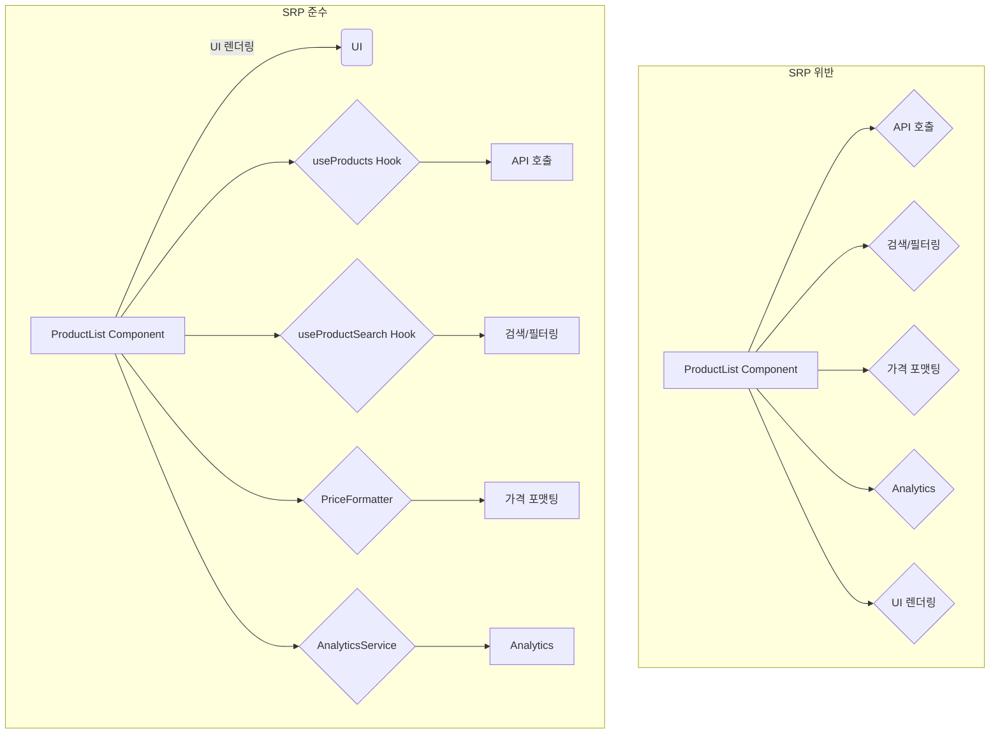
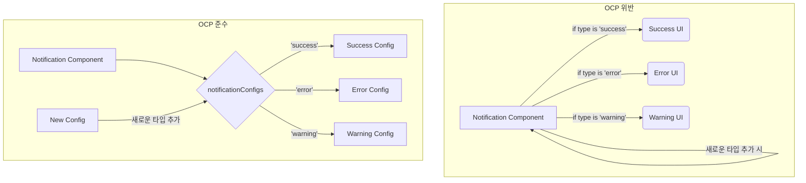
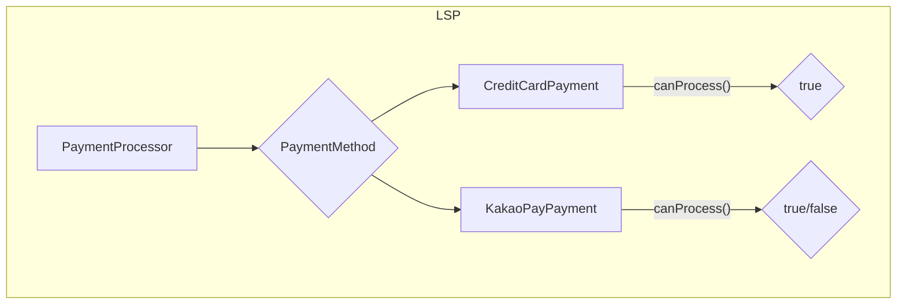
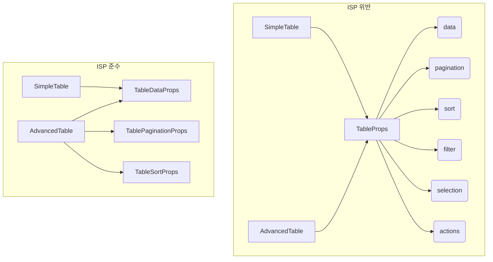

## 서론

"왜 이 컴포넌트만 수정했는데 다른 곳도 다 고쳐야 하지?"
"새로운 기능 하나 추가하려는데 코드를 어디서부터 손대야 할지 모르겠어..."

프론트엔드 개발을 하다 보면 이런 고민을 자주 하게 됩니다. 특히 프로젝트가 커질수록 컴포넌트 간 의존성이 복잡해지고, 코드 수정이 두려워지죠.

저도 최근에 이런 문제를 겪으면서 디자인 패턴을 공부하기 시작했습니다. 그런데 디자인 패턴을 제대로 이해하려고 하니, 그 기반이 되는 SOLID 원칙부터 알아야 한다는 걸 깨달았습니다. Robert C. Martin(Uncle Bob)이 제시한 이 SOLID 원칙은 사실상 대부분의 디자인 패턴의 근간이 되거든요.

문제는 SOLID 원칙을 다룬 글은 많지만, 대부분 Java나 백엔드 관점에서 설명하고 있다는 점이었습니다. 프론트엔드 개발자 입장에서 React와 TypeScript로 어떻게 적용할 수 있는지 정리된 자료를 찾기 어려웠습니다.

그래서 이번 기회에 제가 직접 정리해보기로 했습니다. 이 글에서는 TypeScript와 React를 사용하는 실무 개발자의 관점에서, SOLID 원칙을 어떻게 활용할 수 있는지 구체적인 예제와 함께 알아보겠습니다.

## SOLID란?

SOLID는 다섯 가지 설계 원칙의 앞 글자를 딴 약어입니다:

- **S**ingle Responsibility Principle (단일 책임 원칙)
- **O**pen-Closed Principle (개방-폐쇄 원칙)
- **L**iskov Substitution Principle (리스코프 치환 원칙)
- **I**nterface Segregation Principle (인터페이스 분리 원칙)
- **D**ependency Inversion Principle (의존성 역전 원칙)

이 원칙들은 절대적인 규칙이 아니라 상황에 맞게 적용하는 도구입니다. 작은 컴포넌트에 모든 원칙을 강제로 적용하면 오히려 코드가 복잡해질 수 있으니, 프로젝트 규모와 팀 상황을 고려해서 유연하게 활용하는 것이 중요합니다.

## 1. SRP (Single Responsibility Principle) - 단일 책임 원칙

### 핵심 개념

> "하나의 클래스/모듈은 변경되어야 할 이유가 오직 하나여야 한다"

### 실무에서의 의미

SRP를 "하나의 기능만 해야 한다"로 이해하면 잘못된 방향으로 갈 수 있습니다. 진짜 의미는 **"코드를 수정해야 하는 이유가 하나여야 한다"**는 것입니다.

실제 예를 들어볼까요? 제품 목록 컴포넌트에 검색, 정렬, 가격 포맷팅, API 호출을 모두 넣으면 어떻게 될까요? 디자이너가 "가격 표시 방식을 바꿔주세요"라고 하면, 검색이나 정렬 기능에는 손대지 않았는데도 전체 컴포넌트를 다시 테스트해야 합니다. 이게 바로 SRP를 위반한 결과입니다.

### 코드 비교

<CodeComparison>

```typescript
// SRP 위반: 여러 책임이 한 컴포넌트에 섞임
function ProductList() {
  const [products, setProducts] = useState([])
  const [loading, setLoading] = useState(false)
  const [searchTerm, setSearchTerm] = useState('')

  // API 호출 + 에러 처리 + 로딩 상태 관리
  useEffect(() => {
    setLoading(true)
    fetch('/api/products')
      .then(res => res.json())
      .then(data => setProducts(data))
      .catch(err => alert('에러 발생: ' + err.message))
      .finally(() => setLoading(false))
  }, [])

  // 검색 필터링 로직
  const filteredProducts = products.filter(product =>
    product.name.toLowerCase().includes(searchTerm.toLowerCase())
  )

  // 가격 포맷팅 로직
  const formatPrice = (price: number) => {
    return new Intl.NumberFormat('ko-KR', {
      style: 'currency',
      currency: 'KRW'
    }).format(price)
  }

  // Analytics 추적
  const trackProductClick = (productId: string) => {
    fetch('/api/analytics', {
      method: 'POST',
      body: JSON.stringify({ event: 'product_click', productId })
    })
  }

  // UI 렌더링
  return (
    <div>
      <input value={searchTerm} onChange={e => setSearchTerm(e.target.value)} />
      {loading ? (
        <Spinner />
      ) : (
        filteredProducts.map(product => (
          <div key={product.id} onClick={() => trackProductClick(product.id)}>
            <h3>{product.name}</h3>
            <p>{formatPrice(product.price)}</p>
          </div>
        ))
      )}
    </div>
  )
}
```

```typescript
// SRP 준수: 책임을 분리한 컴포넌트
function ProductList() {
  const [searchTerm, setSearchTerm] = useState('') // UI 상태 관리
  const { products, loading, error } = useProducts() // API 호출 책임
  const filteredProducts = useProductSearch(products, searchTerm) // 검색 필터링 책임

  if (loading) return <Spinner />
  if (error) return <ErrorMessage error={error} />

  return (
    <div>
      <SearchInput value={searchTerm} onChange={setSearchTerm} />
      <ProductGrid
        products={filteredProducts}
        onProductClick={(id) => AnalyticsService.trackProductClick(id)}
        formatPrice={PriceFormatter.toKRW}
      />
    </div>
  )
}
```

</CodeComparison>

**변경 이유를 5개 → 1개로 줄임:**

- UI 디자인 변경만 이 컴포넌트 수정
- API, 검색, 포맷팅, Analytics는 각자 분리됨



### 실무 적용 팁

SRP를 React에서 효과적으로 구현하기 위한 구체적인 방법들:

- **커스텀 훅으로 로직 분리**: 데이터 페칭, 검색/필터링, 폼 관리 등을 별도 훅으로 분리 → 상태 관리 책임과 UI 책임을 분리
- **서비스 레이어 구성**: API 호출, Analytics, 로컬 스토리지 등을 별도 서비스로 분리 → 외부 의존성 관리 책임을 분리
- **유틸리티 함수 분리**: 포맷팅, 검증, 계산 로직 등을 순수 함수로 분리 → 데이터 처리 책임을 분리
- **프레젠테이셔널/컨테이너 패턴**: 비즈니스 로직과 UI를 명확히 분리 → 데이터 관리 책임과 렌더링 책임을 분리

## 2. OCP (Open-Closed Principle) - 개방-폐쇄 원칙

### 핵심 개념

> "확장에는 열려있고, 수정에는 닫혀있어야 한다"

새로운 기능을 추가할 때 기존 코드를 수정하지 않고, 새로운 코드를 추가하는 방식으로 확장할 수 있어야 합니다.

### 코드 비교

<CodeComparison>

```typescript
// ❌ OCP 위반: 새로운 알림 타입 추가 시 기존 코드 수정 필요
function Notification({ type, message }: { type: string; message: string }) {
  if (type === 'success') {
    return (
      <div className="bg-green-500">
        <CheckIcon />
        <span>{message}</span>
      </div>
    )
  }
  if (type === 'error') {
    return (
      <div className="bg-red-500">
        <ErrorIcon />
        <span>{message}</span>
      </div>
    )
  }
  if (type === 'warning') {
    return (
      <div className="bg-yellow-500">
        <WarningIcon />
        <span>{message}</span>
      </div>
    )
  }
  // 새로운 타입(info, loading 등) 추가할 때마다 여기를 수정해야 함
  return <div>{message}</div>
}
```

```typescript
// ✅ OCP 준수: Strategy Pattern으로 확장 가능하게 구현
// 새로운 알림 타입 추가 시 기존 컴포넌트 코드 수정 없이 설정만 추가

interface NotificationConfig {
  bgColor: string
  icon: React.ReactNode
}

const notificationConfigs: Record<string, NotificationConfig> = {
  success: {
    bgColor: 'bg-green-500',
    icon: <CheckIcon />
  },
  error: {
    bgColor: 'bg-red-500',
    icon: <ErrorIcon />
  },
  warning: {
    bgColor: 'bg-yellow-500',
    icon: <WarningIcon />
  }
}

function Notification({ type, message }: { type: string; message: string }) {
  const config = notificationConfigs[type]

  if (!config) {
    return <div>{message}</div>
  }

  return (
    <div className={config.bgColor}>
      {config.icon}
      <span>{message}</span>
    </div>
  )
}

// 새로운 타입 추가는 기존 코드 수정 없이 가능
notificationConfigs.info = {
  bgColor: 'bg-blue-500',
  icon: <InfoIcon />
}
```

</CodeComparison>

**확장 방식 변경:**

- ✅ 새로운 타입 추가 시 기존 함수 수정 불필요
- 설정 객체만 확장하면 됨



### React의 Composition Pattern으로 OCP 구현

OCP의 "확장에는 열려있고, 수정에는 닫혀있어야 한다"는 원칙을 React에서 가장 자연스럽게 구현하는 방법이 Composition Pattern입니다. 기존 컴포넌트를 수정하지 않고도 새로운 기능을 확장할 수 있습니다.

```typescript
// ✅ Composition을 통한 OCP 구현
function Modal({ children }: { children: React.ReactNode }) {
  return (
    <div className="modal-overlay">
      <div className="modal-content">{children}</div>
    </div>
  )
}

Modal.Header = ({ children }: { children: React.ReactNode }) => (
  <div className="modal-header">{children}</div>
)

Modal.Body = ({ children }: { children: React.ReactNode }) => (
  <div className="modal-body">{children}</div>
)

Modal.Footer = ({ children }: { children: React.ReactNode }) => (
  <div className="modal-footer">{children}</div>
)

// 사용: 확장 가능하고 유연함
function ConfirmModal() {
  return (
    <Modal>
      <Modal.Header>확인</Modal.Header>
      <Modal.Body>정말 삭제하시겠습니까?</Modal.Body>
      <Modal.Footer>
        <Button onClick={handleConfirm}>확인</Button>
        <Button onClick={handleCancel}>취소</Button>
      </Modal.Footer>
    </Modal>
  )
}

// 다른 형태의 모달도 쉽게 생성 가능
function AlertModal() {
  return (
    <Modal>
      <Modal.Header>알림</Modal.Header>
      <Modal.Body>저장되었습니다.</Modal.Body>
      <Modal.Footer>
        <Button onClick={handleClose}>확인</Button>
      </Modal.Footer>
    </Modal>
  )
}
```

### 실무 적용 팁

OCP를 React에서 효과적으로 구현하기 위한 구체적인 방법들:

- **플러그인 아키텍처**: 기능을 플러그인으로 확장 가능하게 설계 → 새 기능 추가 시 기존 코드 수정 방지
- **Render Props / Compound Components**: React의 합성 패턴 활용 → 컴포넌트를 수정하지 않고 새로운 기능 합성
- **설정 기반 렌더링**: JSON 설정으로 UI 동적 생성 → 설정 추가만으로 새로운 UI 확장

## 3. LSP (Liskov Substitution Principle) - 리스코프 치환 원칙

### 핵심 개념

> "하위 타입은 상위 타입을 대체할 수 있어야 한다"

상속이나 인터페이스 구현 시, 부모 타입을 사용하는 곳에 자식 타입을 넣어도 예상대로 동작해야 합니다.

### 코드 비교

<CodeComparison>

```typescript
// ❌ LSP 위반: 인터페이스 계약 위반
interface PaymentMethod {
  processPayment(amount: number): Promise<PaymentResult>
}

class CreditCardPayment implements PaymentMethod {
  async processPayment(amount: number): Promise<PaymentResult> {
    // 정상적으로 결제 처리
    const result = await fetch('/api/payment/card', {
      method: 'POST',
      body: JSON.stringify({ amount })
    })
    return result.json()
  }
}

class KakaoPayPayment implements PaymentMethod {
  async processPayment(amount: number): Promise<PaymentResult> {
    if (amount > 1000000) {
      // 예상치 못한 동작! 100만원 이상은 에러
      throw new Error('카카오페이는 100만원 이하만 결제 가능합니다')
    }
    const result = await fetch('/api/payment/kakao', {
      method: 'POST',
      body: JSON.stringify({ amount })
    })
    return result.json()
  }
}

// 사용처에서 예상치 못한 에러 발생
function PaymentProcessor({ method }: { method: PaymentMethod }) {
  const handlePay = async () => {
    try {
      // CreditCardPayment는 정상 동작하지만 KakaoPayPayment는 에러 발생
      await method.processPayment(1500000)
      alert('결제 완료')
    } catch (error) {
      alert('결제 실패') // 사용자는 왜 실패했는지 모름
    }
  }

  return <Button onClick={handlePay}>결제하기</Button>
}
```

```typescript
// ✅ LSP 준수: 일관된 동작 보장

interface PaymentMethod {
  processPayment(amount: number): Promise<PaymentResult>
  canProcess(amount: number): boolean // 사전 검증 메서드 추가
}

class CreditCardPayment implements PaymentMethod {
  canProcess(amount: number): boolean {
    return amount > 0 // 금액만 양수면 OK
  }

  async processPayment(amount: number): Promise<PaymentResult> {
    const result = await fetch('/api/payment/card', {
      method: 'POST',
      body: JSON.stringify({ amount })
    })
    return result.json()
  }
}

class KakaoPayPayment implements PaymentMethod {
  canProcess(amount: number): boolean {
    return amount > 0 && amount <= 1000000 // 100만원 이하만 가능
  }

  async processPayment(amount: number): Promise<PaymentResult> {
    if (!this.canProcess(amount)) {
      return {
        success: false,
        message: '카카오페이는 100만원 이하만 결제 가능합니다'
      }
    }

    const result = await fetch('/api/payment/kakao', {
      method: 'POST',
      body: JSON.stringify({ amount })
    })
    return result.json()
  }
}

// 어떤 PaymentMethod를 사용해도 동일하게 동작
function PaymentProcessor({ method }: { method: PaymentMethod }) {
  const [amount, setAmount] = useState(0)

  const handlePay = async () => {
    // 사전 검증으로 사용자에게 명확한 피드백
    if (!method.canProcess(amount)) {
      alert('선택한 결제 수단으로는 이 금액을 결제할 수 없습니다')
      return
    }

    const result = await method.processPayment(amount)
    if (result.success) {
      alert('결제 완료')
    } else {
      alert(`결제 실패: ${result.message}`)
    }
  }

  return (
    <div>
      <input type="number" value={amount} onChange={e => setAmount(+e.target.value)} />
      <Button onClick={handlePay} disabled={!method.canProcess(amount)}>
        결제하기
      </Button>
    </div>
  )
}
```

</CodeComparison>

**치환 가능성 확보:**

- ✅ 모든 PaymentMethod 구현체가 동일한 계약 준수
- 사전 검증 메서드로 예측 가능한 동작 보장



### React에서의 LSP

```typescript
// ✅ LSP를 준수하는 Input 컴포넌트 설계

interface FormFieldProps {
  value: string
  onChange: (value: string) => void
  onBlur?: () => void
  error?: string
  placeholder?: string
}

function TextFormField({ value, onChange, onBlur, error, placeholder }: FormFieldProps) {
  return (
    <div>
      <input
        type="text"
        value={value}
        onChange={(e) => onChange(e.target.value)}
        onBlur={onBlur}
        placeholder={placeholder}
      />
      {error && <span className="error">{error}</span>}
    </div>
  )
}

function EmailFormField({ value, onChange, onBlur, error, placeholder }: FormFieldProps) {
  return (
    <div>
      <input
        type="email"
        value={value}
        onChange={(e) => onChange(e.target.value)}
        onBlur={onBlur}
        placeholder={placeholder}
      />
      {error && <span className="error">{error}</span>}
    </div>
  )
}

function PasswordFormField({ value, onChange, onBlur, error, placeholder }: FormFieldProps) {
  const [showPassword, setShowPassword] = useState(false)

  return (
    <div>
      <input
        type={showPassword ? 'text' : 'password'}
        value={value}
        onChange={(e) => onChange(e.target.value)}
        onBlur={onBlur}
        placeholder={placeholder}
      />
      <button onClick={() => setShowPassword(!showPassword)}>
        {showPassword ? '숨기기' : '보기'}
      </button>
      {error && <span className="error">{error}</span>}
    </div>
  )
}

// 어떤 FormField를 사용해도 동일한 props로 동작
function SignUpForm() {
  const [email, setEmail] = useState('')
  const [password, setPassword] = useState('')

  return (
    <form>
      <EmailFormField
        value={email}
        onChange={setEmail}
        placeholder="이메일"
      />
      <PasswordFormField
        value={password}
        onChange={setPassword}
        placeholder="비밀번호"
      />
    </form>
  )
}
```

### 실무 적용 팁

- **Props 인터페이스 일관성 유지**: 같은 역할의 컴포넌트는 동일한 props 구조 사용
- **에러 처리 일관성**: 모든 구현체에서 동일한 에러 처리 전략 사용
- **테스트로 검증**: 구현체를 교체해도 테스트가 통과하는지 확인

## 4. ISP (Interface Segregation Principle) - 인터페이스 분리 원칙

### 핵심 개념

> "클라이언트가 사용하지 않는 인터페이스에 의존하면 안 된다"

거대한 인터페이스보다 작고 구체적인 여러 인터페이스로 분리하는 것이 좋습니다.

### 코드 비교

<CodeComparison>

```typescript
// ❌ ISP 위반: 거대한 Props 인터페이스
interface TableProps {
  // 데이터 관련
  data: any[]
  loading: boolean
  error: Error | null

  // 페이지네이션 관련
  currentPage: number
  totalPages: number
  onPageChange: (page: number) => void

  // 정렬 관련
  sortColumn: string
  sortDirection: 'asc' | 'desc'
  onSort: (column: string) => void

  // 필터링 관련
  filters: Record<string, any>
  onFilterChange: (filters: Record<string, any>) => void

  // 선택 관련
  selectedRows: number[]
  onRowSelect: (rows: number[]) => void

  // 액션 관련
  onRowClick: (row: any) => void
  onRowDelete: (id: number) => void
  onRowEdit: (id: number) => void
}

// 단순한 테이블 컴포넌트도 모든 props를 받아야 함
function SimpleTable(props: TableProps) {
  // data, loading, error만 필요한데 나머지 props도 모두 정의해야 함
  return (
    <table>
      {props.loading ? <Spinner /> : (
        props.data.map(row => <tr key={row.id}><td>{row.name}</td></tr>)
      )}
    </table>
  )
}
```

```typescript
// ✅ ISP 준수: 인터페이스 분리

interface TableDataProps {
  data: any[]
  loading: boolean
  error: Error | null
}

interface TablePaginationProps {
  currentPage: number
  totalPages: number
  onPageChange: (page: number) => void
}

interface TableSortProps {
  sortColumn: string
  sortDirection: 'asc' | 'desc'
  onSort: (column: string) => void
}

interface TableFilterProps {
  filters: Record<string, any>
  onFilterChange: (filters: Record<string, any>) => void
}

interface TableSelectionProps {
  selectedRows: number[]
  onRowSelect: (rows: number[]) => void
}

interface TableActionsProps {
  onRowClick: (row: any) => void
  onRowDelete: (id: number) => void
  onRowEdit: (id: number) => void
}

// 단순한 테이블은 필요한 props만 받음
function SimpleTable({ data, loading, error }: TableDataProps) {
  if (loading) return <Spinner />
  if (error) return <ErrorMessage error={error} />

  return (
    <table>
      {data.map(row => (
        <tr key={row.id}>
          <td>{row.name}</td>
        </tr>
      ))}
    </table>
  )
}

// 복잡한 테이블은 필요한 props들을 조합
function AdvancedTable(props: TableDataProps & TablePaginationProps & TableSortProps) {
  // 필요한 기능만 조합해서 사용
  return (
    <div>
      <table>
        <thead>
          <tr>
            <th onClick={() => props.onSort('name')}>
              이름 {props.sortColumn === 'name' && (props.sortDirection === 'asc' ? '↑' : '↓')}
            </th>
          </tr>
        </thead>
        <tbody>
          {props.data.map(row => (
            <tr key={row.id}>
              <td>{row.name}</td>
            </tr>
          ))}
        </tbody>
      </table>
      <Pagination
        currentPage={props.currentPage}
        totalPages={props.totalPages}
        onPageChange={props.onPageChange}
      />
    </div>
  )
}
```

</CodeComparison>

**인터페이스 분리 효과:**

- ✅ 필요한 props만 선택적으로 사용
- 컴포넌트 간 불필요한 의존성 제거



### React Context에서의 ISP

```typescript
// ❌ 거대한 Context
interface AppContextType {
  user: User
  theme: Theme
  language: string
  notifications: Notification[]
  cart: CartItem[]
  // ... 더 많은 상태들
}

// ✅ Context 분리
interface AuthContextType {
  user: User | null
  login: (credentials: Credentials) => Promise<void>
  logout: () => void
}

interface ThemeContextType {
  theme: Theme
  setTheme: (theme: Theme) => void
}

interface CartContextType {
  items: CartItem[]
  addItem: (item: CartItem) => void
  removeItem: (id: string) => void
}

// 컴포넌트는 필요한 Context만 사용
function ShoppingCart() {
  const { items, removeItem } = useContext(CartContext)
  // user, theme 등 불필요한 상태에 의존하지 않음

  return (
    <div>
      {items.map(item => (
        <div key={item.id}>
          {item.name}
          <button onClick={() => removeItem(item.id)}>삭제</button>
        </div>
      ))}
    </div>
  )
}
```

### 실무 적용 팁

- **TypeScript의 Pick, Omit 활용**: 필요한 타입만 선택적으로 사용
- **Props 분해**: 거대한 config 객체 대신 개별 props 전달
- **Context 분리**: 하나의 거대한 Context 대신 용도별 Context 분리

## 5. DIP (Dependency Inversion Principle) - 의존성 역전 원칙

### 핵심 개념

> "구체적인 구현이 아닌 추상화에 의존해야 한다"

고수준 모듈(비즈니스 로직)이 저수준 모듈(구체적 구현)에 직접 의존하면 안 되며, 둘 다 추상화에 의존해야 합니다.

### 코드 비교

<CodeComparison>

```typescript
// ❌ DIP 위반: 구체적 구현에 강하게 결합

function OrderList() {
  const [orders, setOrders] = useState([])

  useEffect(() => {
    // axios에 직접 의존
    axios.get('/api/orders')
      .then(response => setOrders(response.data))
      .catch(error => console.error(error))
  }, [])

  const handleExport = () => {
    // localStorage에 직접 의존
    localStorage.setItem('orders', JSON.stringify(orders))
    alert('주문 목록이 저장되었습니다')
  }

  const handleNotify = () => {
    // 특정 알림 라이브러리에 직접 의존
    toast.success('주문이 업데이트되었습니다')
  }

  return (
    <div>
      {orders.map(order => (
        <div key={order.id}>{order.title}</div>
      ))}
      <button onClick={handleExport}>내보내기</button>
      <button onClick={handleNotify}>알림</button>
    </div>
  )
}

// 문제점:
// - axios를 다른 HTTP 클라이언트로 교체 어려움
// - localStorage를 IndexedDB로 변경 어려움
// - 테스트 시 Mock 주입 어려움
```

```typescript
// ✅ DIP 준수: 추상화에 의존

// 1. 추상화 정의
interface HttpClient {
  get<T>(url: string): Promise<T>
  post<T>(url: string, data: any): Promise<T>
}

interface StorageService {
  save(key: string, data: any): void
  load(key: string): any
}

interface NotificationService {
  success(message: string): void
  error(message: string): void
}

// 2. 구체적 구현들
class AxiosHttpClient implements HttpClient {
  async get<T>(url: string): Promise<T> {
    const response = await axios.get(url)
    return response.data
  }

  async post<T>(url: string, data: any): Promise<T> {
    const response = await axios.post(url, data)
    return response.data
  }
}

class LocalStorageService implements StorageService {
  save(key: string, data: any): void {
    localStorage.setItem(key, JSON.stringify(data))
  }

  load(key: string): any {
    const item = localStorage.getItem(key)
    return item ? JSON.parse(item) : null
  }
}

class ToastNotificationService implements NotificationService {
  success(message: string): void {
    toast.success(message)
  }

  error(message: string): void {
    toast.error(message)
  }
}

// 3. Context로 의존성 주입
const ServiceContext = createContext<{
  http: HttpClient
  storage: StorageService
  notification: NotificationService
} | null>(null)

function App() {
  const services = {
    http: new AxiosHttpClient(),
    storage: new LocalStorageService(),
    notification: new ToastNotificationService()
  }

  return (
    <ServiceContext.Provider value={services}>
      <OrderList />
    </ServiceContext.Provider>
  )
}

// 4. 추상화에 의존하는 컴포넌트
function OrderList() {
  const services = useContext(ServiceContext)
  if (!services) throw new Error('Services not provided')

  const [orders, setOrders] = useState([])

  useEffect(() => {
    // 추상화된 인터페이스 사용
    services.http.get('/api/orders')
      .then(data => setOrders(data))
      .catch(error => services.notification.error('주문 목록을 불러올 수 없습니다'))
  }, [services])

  const handleExport = () => {
    services.storage.save('orders', orders)
    services.notification.success('주문 목록이 저장되었습니다')
  }

  return (
    <div>
      {orders.map(order => (
        <div key={order.id}>{order.title}</div>
      ))}
      <button onClick={handleExport}>내보내기</button>
    </div>
  )
}
```

</CodeComparison>

**의존성 역전 효과:**

- ✅ 구현체 교체 용이 (axios → fetch, localStorage → IndexedDB)
- 테스트 시 Mock 주입 가능

### Custom Hook으로 추상화

```typescript
// ✅ Custom Hook으로 서비스 접근 캡슐화

function useServices() {
  const services = useContext(ServiceContext)
  if (!services) throw new Error('Services not provided')
  return services
}

function useOrders() {
  const { http, notification } = useServices()
  const [orders, setOrders] = useState([])
  const [loading, setLoading] = useState(false)

  useEffect(() => {
    setLoading(true)
    http.get('/api/orders')
      .then(data => setOrders(data))
      .catch(error => notification.error('주문 목록을 불러올 수 없습니다'))
      .finally(() => setLoading(false))
  }, [http, notification])

  return { orders, loading }
}

// 컴포넌트는 구현 세부사항을 몰라도 됨
function OrderList() {
  const { orders, loading } = useOrders()
  const { storage, notification } = useServices()

  const handleExport = () => {
    storage.save('orders', orders)
    notification.success('주문 목록이 저장되었습니다')
  }

  if (loading) return <Spinner />

  return (
    <div>
      {orders.map(order => (
        <div key={order.id}>{order.title}</div>
      ))}
      <button onClick={handleExport}>내보내기</button>
    </div>
  )
}
```

### 실무 적용 팁

DIP를 React에서 효과적으로 구현하기 위한 구체적인 방법들:

- **서비스 레이어 분리**: API 호출, 저장소, 알림 등을 서비스로 추상화 → 고수준 컴포넌트가 구체적 구현에 의존하지 않음
- **Context로 의존성 주입**: Provider 패턴으로 구현체 주입 → 런타임에 의존성을 외부에서 주입 가능
- **Custom Hook으로 캡슐화**: 구현 세부사항을 Hook 안에 숨기기 → 컴포넌트는 Hook의 인터페이스에만 의존
- **환경별 구현체 교체**: 개발/테스트/프로덕션 환경에 맞는 구현체 주입 → 환경에 따른 유연한 구현 교체

## 프론트엔드 개발자를 위한 SOLID 체크리스트

코드를 작성할 때 SOLID 원칙을 제대로 지키고 있는지 확인할 수 있는 체크리스트입니다.

<SOLIDChecklistModal />

## SOLID 원칙을 너무 엄격하게 지키지 마세요

### 오버엔지니어링 주의

SOLID 원칙을 모든 코드에 적용하려다 보면 오히려 코드가 복잡해질 수 있습니다.

```typescript
// ❌ 과도한 추상화
interface ButtonClickHandler {
  handle(): void
}

class LogoutClickHandler implements ButtonClickHandler {
  handle() {
    console.log('logout')
  }
}

function LogoutButton() {
  const handler = new LogoutClickHandler()
  return <button onClick={() => handler.handle()}>Logout</button>
}

// ✅ 적절한 수준의 단순함
function LogoutButton() {
  const handleLogout = () => {
    console.log('logout')
  }

  return <button onClick={handleLogout}>Logout</button>
}
```

### 언제 SOLID를 적용해야 하나?

- **작은 프로토타입**: SOLID 적용 불필요, 빠른 개발에 집중
- **중규모 프로젝트**: 핵심 도메인 로직에만 적용
- **대규모 프로젝트**: SOLID 원칙을 적극 활용하여 유지보수성 확보

### 팀 컨벤션이 우선

SOLID 원칙보다 팀의 코딩 컨벤션과 일관성을 유지하는 것이 더 중요합니다. 혼자만 SOLID를 강하게 적용하면 팀원들이 코드를 이해하기 어려워질 수 있습니다.

## 결론

SOLID 원칙은 프론트엔드 개발에서도 충분히 유용한 설계 가이드입니다. 특히 다음과 같은 상황에서 큰 도움이 됩니다:

1. **유지보수성**: 코드 변경 시 영향 범위를 최소화
2. **테스트 용이성**: Mock 객체 주입이 쉬워져 테스트 작성이 편해짐
3. **확장성**: 새로운 기능 추가 시 기존 코드 수정 최소화
4. **협업**: 명확한 책임 분리로 협업이 수월해짐

다만 주의할 점은, SOLID 원칙을 지키는 것 자체가 목표가 되어서는 안 됩니다. 버튼 하나에 인터페이스를 3개 만들고 클래스를 4개 만드는 것은 과도한 추상화입니다. **실용성과 복잡성의 균형**을 맞추는 것이 진짜 실력입니다.

솔직히 말하면, 저 역시 코드를 작성하다 보면 이런 원칙들이 잘 지켜지지 않을 경우가 많습니다. 일정에 쫓기다 보면 "일단 작동하게 만들자"는 생각으로 모든 로직을 한 컴포넌트에 때려 넣곤 하죠. 그리고 나중에 "이 코드 누가 짠 거야?"라며 과거의 나를 원망하게 됩니다.

이 글도 사실 미래의 저에게 도움이 되기를 기대하며 작성한 글입니다. 몇 달 후에 코드 리팩토링을 할 때, "아, 그때 정리해둔 SOLID 원칙 글이 있었지!"라며 이 글을 다시 찾아보게 되길 바라면서요.

프로젝트가 커질수록 코드 수정이 두려워진다면, 이 글에서 소개한 SOLID 원칙을 하나씩 적용해보세요. 처음부터 완벽하게 지킬 필요는 없습니다. 리팩토링하면서 점진적으로 개선하는 것만으로도 충분합니다.

## 참고 자료

- [객체 지향 설계의 5가지 원칙 SOLID - Inpa Dev](https://inpa.tistory.com/entry/OOP-%F0%9F%92%A0-%EA%B0%9D%EC%B2%B4-%EC%A7%80%ED%96%A5-%EC%84%A4%EA%B3%84%EC%9D%98-5%EA%B0%80%EC%A7%80-%EC%9B%90%EC%B9%99-SOLID)
- [SOLID의 진실과 오해 - 카카오뱅크 기술 블로그](https://tech.kakaobank.com/posts/2411-solid-truth-or-myths-for-developers/)
