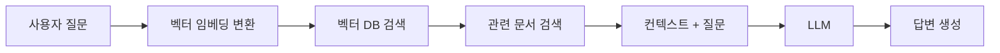
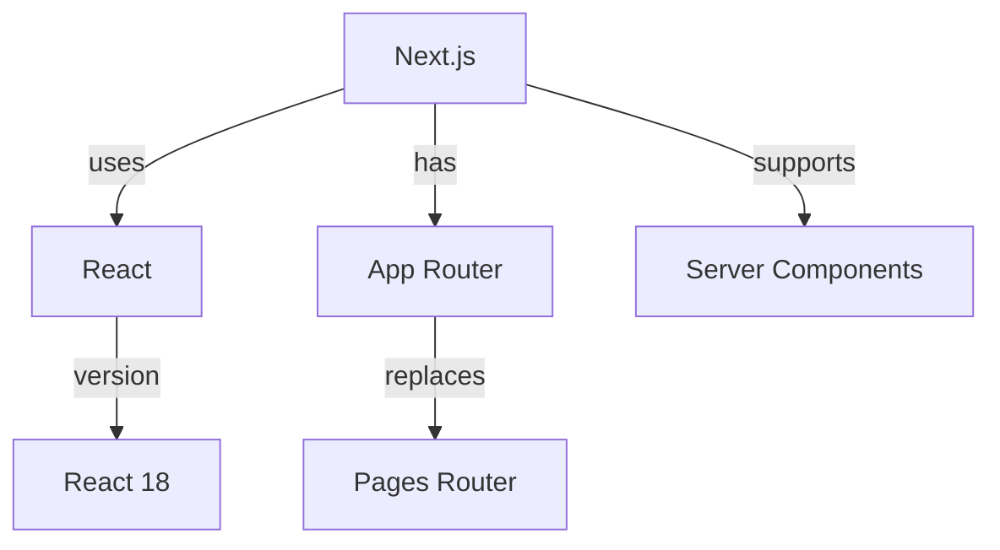

## 서론

요즘 AI 관련 프로젝트를 보면 RAG(Retrieval-Augmented Generation)라는 용어를 정말 자주 접하게 됩니다. ChatGPT 같은 LLM(Large Language Model)이 이미 충분히 똑똑한데, 왜 굳이 RAG 시스템을 추가로 구축해야 할까요?

이 글에서는 RAG가 무엇인지, 왜 많은 개발자들이 RAG 아키텍처를 활용해서 AI 툴을 만드는지, 그리고 RAG를 편하게 구축할 수 있는 다양한 서비스들을 소개하겠습니다.

## RAG가 필요한 이유: LLM의 한계

### 1. 지식 컷오프 문제

LLM은 학습 데이터의 시점까지만 알고 있습니다. 예를 들어 GPT-4의 경우 2023년 4월까지의 데이터로 학습되었기 때문에, 그 이후의 정보는 알 수 없습니다.

```javascript
// LLM에게 물어보면
'2025년 1월의 최신 Next.js 버전은?';
// ❌ 답변할 수 없음 (2023년 4월 이후 정보)

// RAG를 사용하면
// 1. 최신 Next.js 문서에서 정보 검색
// 2. 검색된 정보를 바탕으로 답변 생성
// ✅ "Next.js 15.1.0입니다" (실시간 정보 반영)
```

### 2. 환각(Hallucination) 문제

LLM은 때때로 그럴듯하지만 **잘못된 정보**를 자신있게 말하는 경우가 있습니다. 이를 "환각(Hallucination)"이라고 부릅니다.

```
질문: "우리 회사의 복지 정책이 뭐야?"
LLM: "일반적인 회사들은 이런 복지를..." (환각 - 추측으로 답변)

RAG: "회사 내부 문서를 검색한 결과..." (실제 데이터 기반 답변)
```

### 3. 도메인 특화 지식 부족

LLM은 일반적인 지식은 풍부하지만, **특정 회사나 프로젝트의 내부 정보**는 알 수 없습니다.

- 회사 내부 문서
- 프로젝트 코드베이스
- 고객 데이터
- 제품 매뉴얼

이런 정보들은 LLM이 학습한 적이 없기 때문에, RAG를 통해 실시간으로 검색하고 제공해야 합니다.

## RAG란 무엇인가?

RAG(Retrieval-Augmented Generation)는 **검색(Retrieval)**과 **생성(Generation)**을 결합한 AI 아키텍처입니다.

### RAG의 작동 원리



1. **사용자 질문을 벡터로 변환**: 질문을 숫자 배열(벡터)로 변환합니다.
2. **벡터 데이터베이스 검색**: 유사한 벡터를 가진 문서를 찾습니다.
3. **관련 문서 추출**: 질문과 가장 관련 있는 문서들을 가져옵니다.
4. **컨텍스트 구성**: 검색된 문서를 LLM에게 제공합니다.
5. **답변 생성**: LLM이 컨텍스트를 바탕으로 답변을 생성합니다.

### 코드로 보는 RAG의 개념

```python
# 간단한 RAG 흐름 (의사 코드)
def answer_with_rag(question):
    # 1. 질문을 벡터로 변환
    question_vector = embed(question)

    # 2. 유사한 문서 검색
    relevant_docs = vector_db.search(question_vector, top_k=3)

    # 3. 컨텍스트 구성
    context = "\n".join([doc.content for doc in relevant_docs])

    # 4. LLM에게 질문 + 컨텍스트 전달
    prompt = f"""
    다음 문서를 참고해서 질문에 답변해주세요:

    {context}

    질문: {question}
    """

    # 5. 답변 생성
    answer = llm.generate(prompt)
    return answer
```

## RAG의 실제 활용 사례

### 1. 고객 지원 챗봇 (DoorDash)

DoorDash는 배달 파트너들을 위한 RAG 기반 챗봇을 운영합니다. 내부 FAQ, 정책 문서, 매뉴얼을 실시간으로 검색해서 정확한 답변을 제공합니다.

### 2. 기업 내부 검색 (Thomson Reuters)

Thomson Reuters는 RAG를 활용해 고객 지원팀이 방대한 내부 데이터베이스에서 필요한 정보를 빠르게 찾을 수 있도록 지원합니다.

### 3. 의료 진단 지원

의료 기관에서는 RAG를 사용해 전자 건강 기록(EHR), 임상 가이드라인, 의학 논문을 검색하여 의사의 진단을 보조합니다.

### 4. 법률 리서치

법률 회사에서는 RAG를 통해 수천 개의 판례와 법률 문서를 검색하고, 변호사에게 관련 정보를 제공합니다.

### 5. 코드베이스 이해 (Grab의 A\* bot)

Grab은 사기 조사를 위해 A\* bot이라는 RAG 기반 시스템을 만들었습니다. Slack을 통해 질문하면 관련 쿼리를 실행하고 결과를 요약해줍니다.

## RAG 아키텍처의 진화 (2025년 트렌드)

### 1. Simple RAG with Memory

기본 RAG에 **대화 기록 저장** 기능을 추가한 버전입니다. 이전 대화 내용을 기억해서 더 자연스러운 대화가 가능합니다.

```javascript
// 메모리 포함 RAG
const conversationHistory = [];

function ragWithMemory(question) {
  // 이전 대화 내용 포함
  const context = getRelevantDocs(question);
  const prompt = `
    대화 기록: ${conversationHistory.join('\n')}
    참고 문서: ${context}
    질문: ${question}
  `;

  const answer = llm.generate(prompt);
  conversationHistory.push({ question, answer });
  return answer;
}
```

### 2. GraphRAG

벡터 검색뿐만 아니라 **지식 그래프(Knowledge Graph)**를 활용해서 개념 간의 관계를 이해합니다. 검색 정확도가 최대 99%까지 향상됩니다.



### 3. Long RAG

긴 문서를 효율적으로 처리하기 위한 RAG입니다. 문서 전체를 청크로 나누지 않고, **섹션 단위**로 처리하여 컨텍스트를 보존합니다.

### 4. Agentic RAG

RAG와 **자율 에이전트**를 결합한 버전입니다. 단순히 문서를 검색하는 것을 넘어, API 호출, 데이터베이스 쿼리, 다중 도구 사용이 가능합니다.

```python
# Agentic RAG 예시
def agentic_rag(question):
    # 1. 어떤 도구가 필요한지 판단
    if "최신" in question:
        # API로 실시간 데이터 가져오기
        data = fetch_real_time_data()
    elif "문서" in question:
        # 벡터 DB에서 검색
        data = search_documents()
    elif "계산" in question:
        # 계산기 도구 실행
        data = calculate()

    # 2. 결과를 바탕으로 답변 생성
    return llm.generate(question, context=data)
```

## RAG를 쉽게 구현하는 서비스들

### 1. LangChain

**최적**: 복잡한 워크플로우, 멀티 에이전트 시스템

LangChain은 LLM 애플리케이션을 체인(Chain) 형태로 구성할 수 있는 프레임워크입니다.

**특징:**

- 다양한 도구 통합 (API, DB, 검색 엔진)
- 프롬프트 템플릿 관리
- 멀티 에이전트 지원
- 광범위한 커뮤니티와 플러그인

```python
from langchain.chains import RetrievalQA
from langchain.vectorstores import Pinecone
from langchain.embeddings import OpenAIEmbeddings
from langchain.llms import OpenAI

# 벡터 스토어 생성
vectorstore = Pinecone.from_documents(
    documents,
    OpenAIEmbeddings()
)

# RAG 체인 구성
qa = RetrievalQA.from_chain_type(
    llm=OpenAI(),
    chain_type="stuff",
    retriever=vectorstore.as_retriever()
)

# 질문 답변
answer = qa.run("Next.js에서 서버 컴포넌트는 어떻게 사용하나요?")
```

**장점**: 매우 유연하고 확장 가능, 다양한 통합
**단점**: 설정이 복잡할 수 있음

### 2. LlamaIndex

**최적**: 문서 인덱싱, 고품질 검색, RAG 파이프라인

LlamaIndex는 **데이터 인덱싱과 검색**에 특화된 프레임워크입니다. 2025년 기준 검색 정확도가 35% 향상되었고, 문서 검색 속도가 LangChain보다 40% 빠릅니다.

**특징:**

- 문서 파싱 및 인덱싱에 강함
- 다양한 인덱스 전략 (벡터, 그래프, 트리)
- RAG 관찰성(Observability) 도구
- 구조화된 데이터 연결에 최적

```python
from llama_index import VectorStoreIndex, SimpleDirectoryReader

# 문서 로드
documents = SimpleDirectoryReader('data').load_data()

# 인덱스 생성
index = VectorStoreIndex.from_documents(documents)

# 쿼리 엔진
query_engine = index.as_query_engine()

# 질문
response = query_engine.query("RAG의 장점은 무엇인가요?")
print(response)
```

**장점**: 빠른 검색 속도, 직관적인 API, 고품질 검색
**단점**: LangChain에 비해 생태계가 작음

### 3. 벡터 데이터베이스

#### Pinecone

**완전 관리형** 벡터 데이터베이스로, 인프라 관리가 필요 없습니다.

```python
import pinecone

pinecone.init(api_key="YOUR_API_KEY")
index = pinecone.Index("my-index")

# 벡터 저장
index.upsert([
    ("id1", [0.1, 0.2, 0.3, ...], {"text": "문서 내용"}),
    ("id2", [0.4, 0.5, 0.6, ...], {"text": "다른 문서"})
])

# 검색
results = index.query([0.1, 0.2, 0.3, ...], top_k=3)
```

**장점**: 관리 불필요, 확장성 뛰어남
**단점**: 비용 발생 (무료 티어 제한적)

#### Weaviate

**AI 네이티브** 벡터 데이터베이스로, 벡터 검색과 키워드 검색을 동시에 지원하는 **하이브리드 검색**이 특징입니다.

```python
import weaviate

client = weaviate.Client("http://localhost:8080")

# 스키마 생성
client.schema.create_class({
    "class": "Document",
    "vectorizer": "text2vec-openai"
})

# 데이터 추가
client.data_object.create({
    "content": "RAG는 검색과 생성을 결합한다"
}, "Document")

# 검색
result = client.query.get("Document", ["content"]) \
    .with_near_text({"concepts": ["RAG"]}) \
    .with_limit(3) \
    .do()
```

**장점**: 하이브리드 검색, 오픈소스, 멀티모달 지원
**단점**: 셀프 호스팅 필요 (관리형 클라우드 옵션 있음)

#### Chroma

**로컬 개발**에 최적화된 오픈소스 벡터 DB입니다.

```python
import chromadb

client = chromadb.Client()
collection = client.create_collection("my_docs")

# 문서 추가
collection.add(
    documents=["RAG는 환각을 줄인다", "벡터 검색은 빠르다"],
    ids=["doc1", "doc2"]
)

# 검색
results = collection.query(
    query_texts=["RAG란?"],
    n_results=2
)
```

**장점**: 완전 무료, 로컬 개발 편리, 간단한 API
**단점**: 대규모 프로덕션에는 부적합

#### FAISS

Facebook(Meta)에서 만든 **초고속** 벡터 검색 라이브러리입니다.

```python
import faiss
import numpy as np

# 인덱스 생성
dimension = 128
index = faiss.IndexFlatL2(dimension)

# 벡터 추가
vectors = np.random.random((1000, dimension)).astype('float32')
index.add(vectors)

# 검색
query_vector = np.random.random((1, dimension)).astype('float32')
distances, indices = index.search(query_vector, k=5)
```

**장점**: 매우 빠름, GPU 가속 지원
**단점**: 메타데이터 관리 기능 없음

### 4. 엔터프라이즈 RAG 플랫폼

#### Elastic Enterprise Search

검색 엔진의 강자 Elasticsearch를 기반으로 한 엔터프라이즈급 RAG 플랫폼입니다.

**특징:**

- 강력한 풀텍스트 검색
- 벡터 검색 + 키워드 검색 하이브리드
- 대규모 데이터 처리

#### NVIDIA NeMo Retriever

엔터프라이즈 환경에서 도메인 특화 LLM 파이프라인을 구축할 수 있는 프레임워크입니다.

**특징:**

- GPU 최적화
- 대규모 처리에 적합
- NIM 마이크로서비스와 통합

### 5. RAG as a Service (RaaS)

클라우드 기반으로 RAG를 서비스 형태로 제공하는 플랫폼들도 등장했습니다.

**Latenode**: 노코드/로우코드로 RAG 워크플로우를 시각적으로 구성
**Firecrawl**: 웹 크롤링과 RAG를 결합한 플랫폼
**CustomGPT.ai**: 기업용 맞춤형 GPT + RAG

## LangChain vs LlamaIndex: 어떤 걸 선택할까?

| 항목            | LangChain                   | LlamaIndex                      |
| --------------- | --------------------------- | ------------------------------- |
| **최적 용도**   | 복잡한 워크플로우, 에이전트 | 문서 검색, RAG 파이프라인       |
| **검색 속도**   | 보통                        | 40% 더 빠름                     |
| **검색 정확도** | 좋음                        | 35% 더 높음 (2025년 기준)       |
| **학습 곡선**   | 가파름                      | 완만함                          |
| **생태계**      | 매우 큼                     | 중간                            |
| **호환성**      | 다양한 통합                 | LangChain, OpenAI, Anthropic 등 |
| **사용 편의성** | 복잡함                      | 간단함                          |

**추천:**

- **빠른 프로토타이핑 + 문서 검색**: LlamaIndex
- **복잡한 에이전트 + 멀티 도구**: LangChain
- **둘 다 사용**: LlamaIndex로 검색, LangChain으로 워크플로우 구성

## RAG 구축 시 고려사항

### 1. 데이터 품질

RAG는 검색된 문서의 품질에 크게 의존합니다. 쓰레기 데이터를 넣으면 쓰레기 답변이 나옵니다(GIGO: Garbage In, Garbage Out).

### 2. 청크 크기 (Chunk Size)

문서를 어떤 크기로 나눌지 결정해야 합니다.

```python
# 작은 청크 (256 토큰)
# 장점: 정확한 검색
# 단점: 컨텍스트 부족

# 큰 청크 (1024 토큰)
# 장점: 풍부한 컨텍스트
# 단점: 노이즈 증가, 비용 증가
```

### 3. 임베딩 모델 선택

- **OpenAI text-embedding-3**: 고품질, 유료
- **Cohere Embed**: 다국어 지원
- **오픈소스 (e.g. Sentence-BERT)**: 무료, 프라이버시 보호

### 4. 비용 관리

- 벡터 DB 저장 비용
- LLM API 호출 비용
- 임베딩 생성 비용

프로덕션 환경에서는 캐싱, 배치 처리, 로컬 모델 사용 등으로 비용을 최적화해야 합니다.

## 결론

RAG는 LLM의 한계를 극복하고 실시간 정보, 도메인 특화 지식, 정확한 답변을 제공하기 위한 필수적인 아키텍처가 되었습니다. 2025년 현재, RAG는 단순한 검색-생성을 넘어 메모리, 그래프, 에이전트와 결합하며 더욱 진화하고 있습니다.

**RAG를 선택해야 하는 경우:**

- 최신 정보가 필요한 애플리케이션
- 기업 내부 문서 검색
- 고객 지원 챗봇
- 도메인 특화 AI 어시스턴트

**도구 선택 가이드:**

- **빠른 시작**: LlamaIndex + Chroma
- **엔터프라이즈**: LangChain + Pinecone/Weaviate
- **비용 최적화**: 오픈소스 (FAISS + Sentence-BERT)
- **노코드**: Latenode 같은 RaaS 플랫폼

RAG는 이제 선택이 아닌 필수입니다. 여러분의 다음 AI 프로젝트에 RAG를 도입해보세요!
